<!--
  Auto-scaffolded from 796 photos taken
  2018-01-31 – 2018-02-06 (7 days).
  Cities: Ballysteen, Inishmore, Rinvyle, Cushkillary, Bunratty, Letterfore.
  Write the story below; add alt text inside the  brackets for captions.
-->

TODO: Write about Ballysteen.

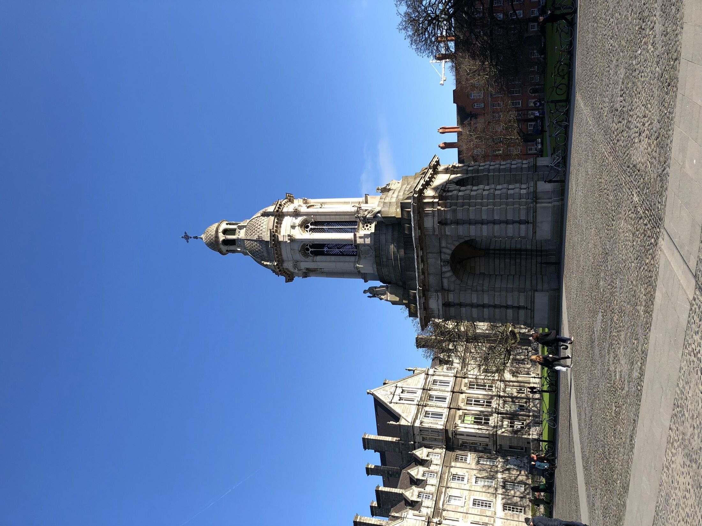

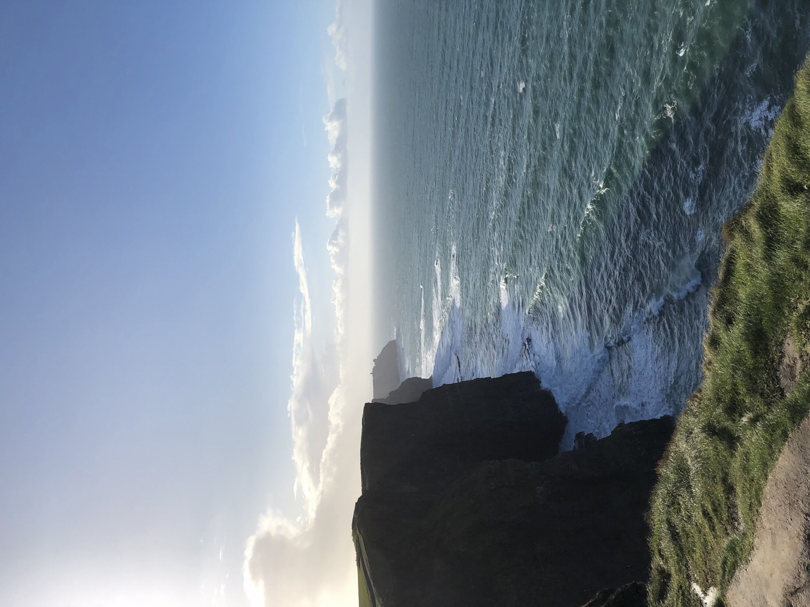

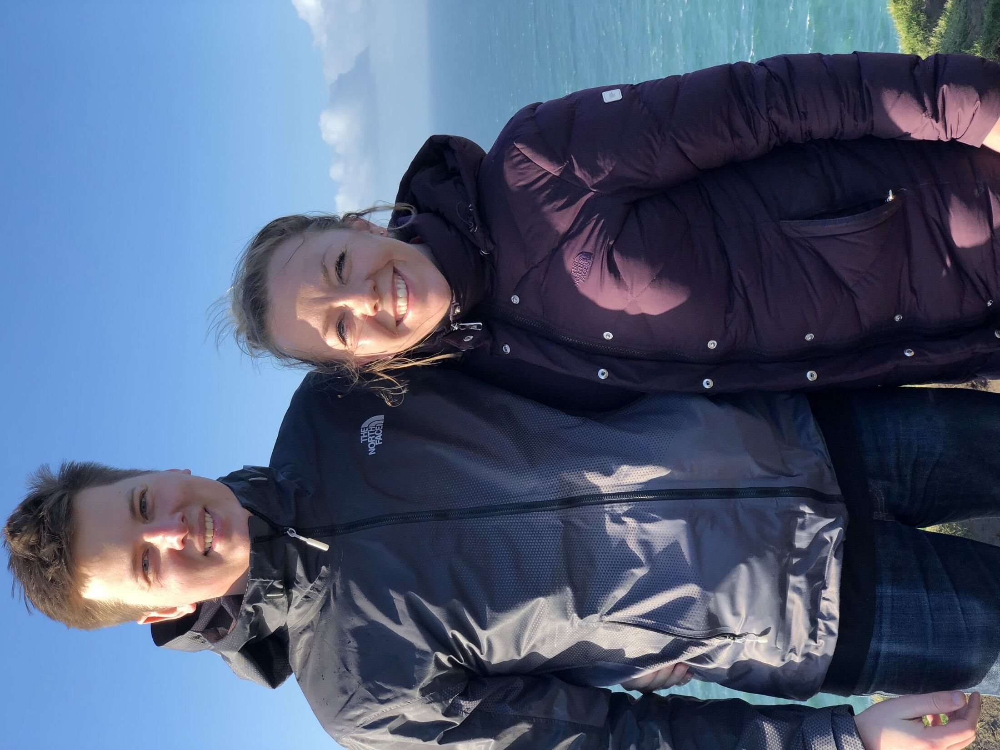

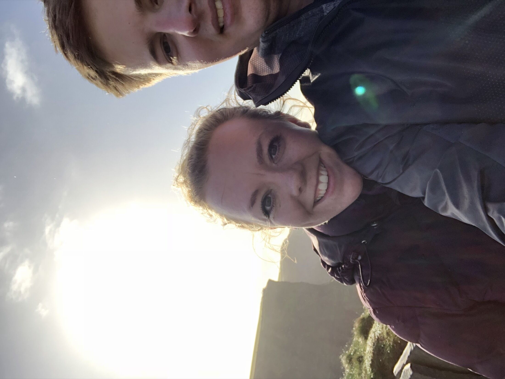

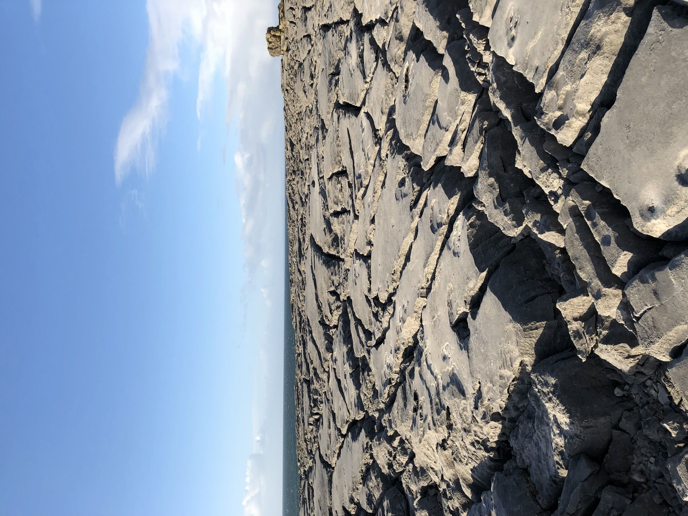

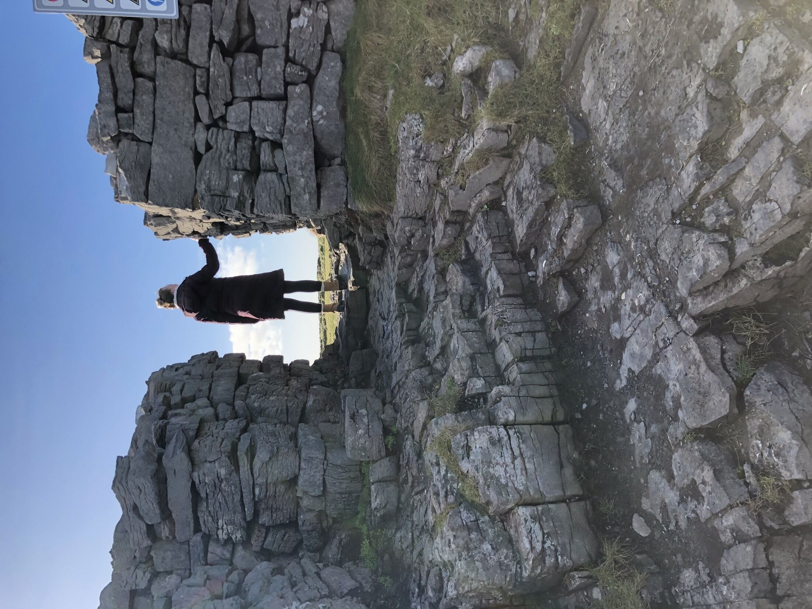

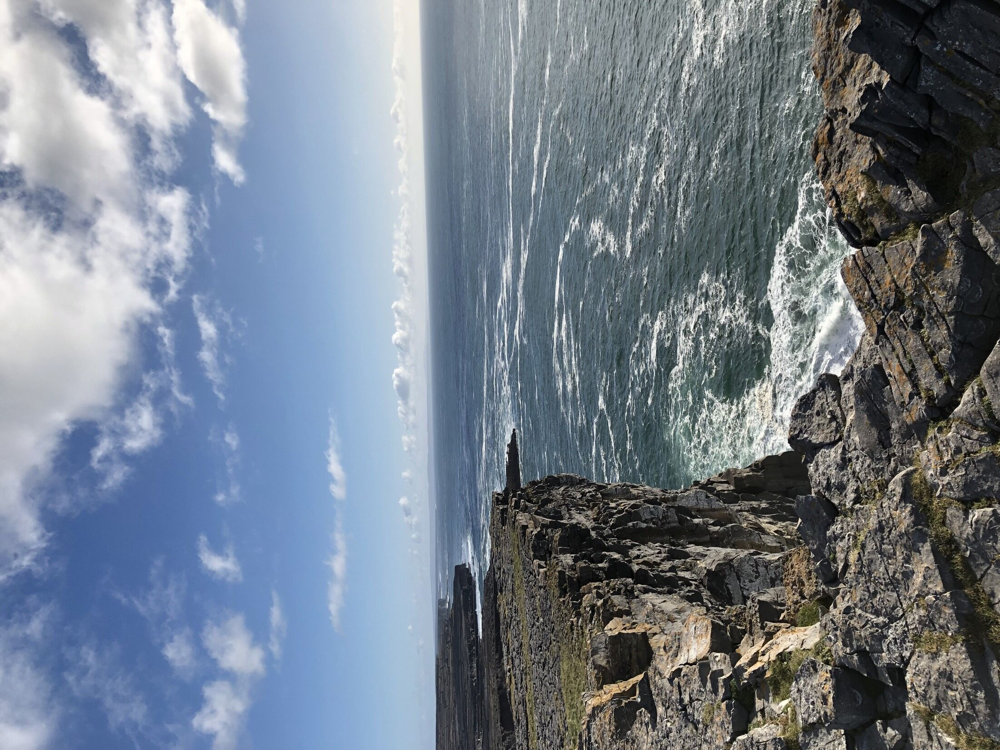

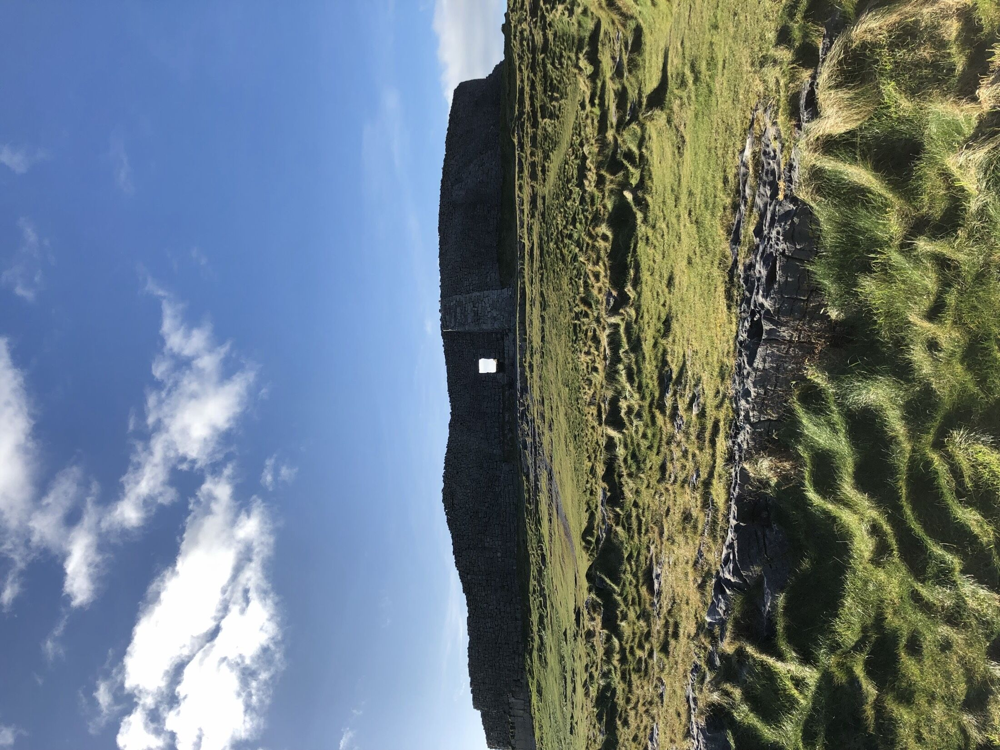

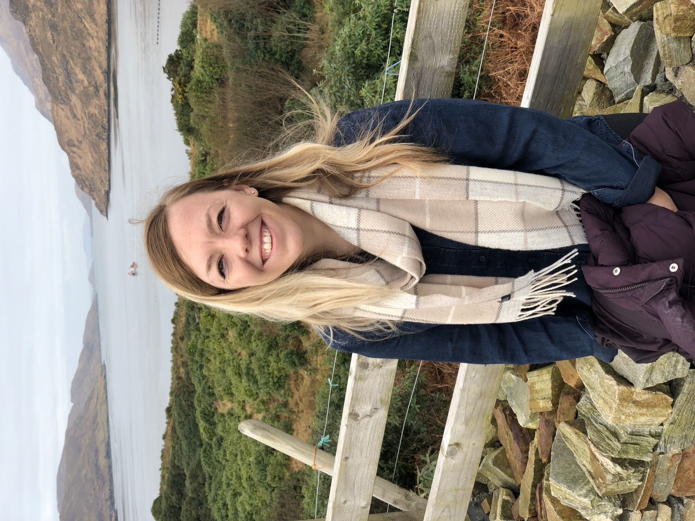

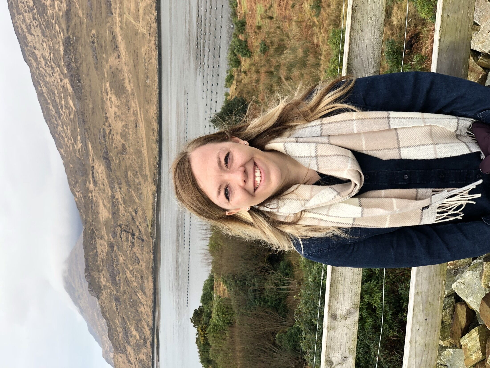

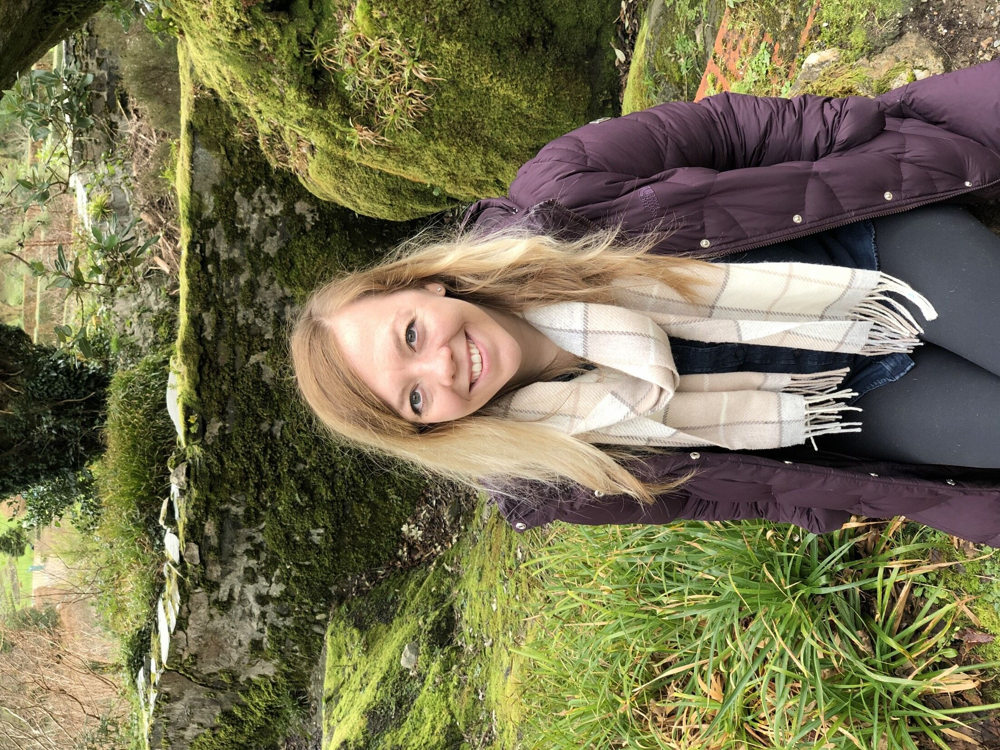

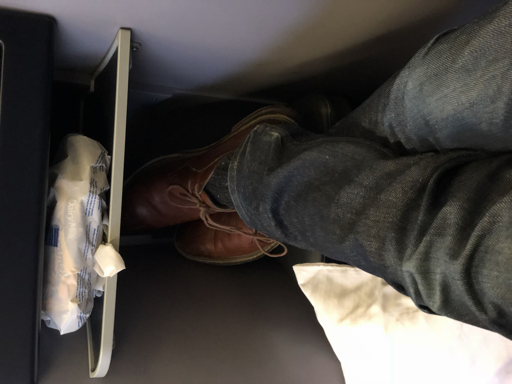
