<!--
  Auto-scaffolded from 126 photos taken
  2019-02-09 – 2019-02-17 (9 days).
  Cities: Banff, Lake Louise, Exshaw, Calgary.
  Write the story below; add alt text inside the  brackets for captions.
-->

TODO: Write about Banff.

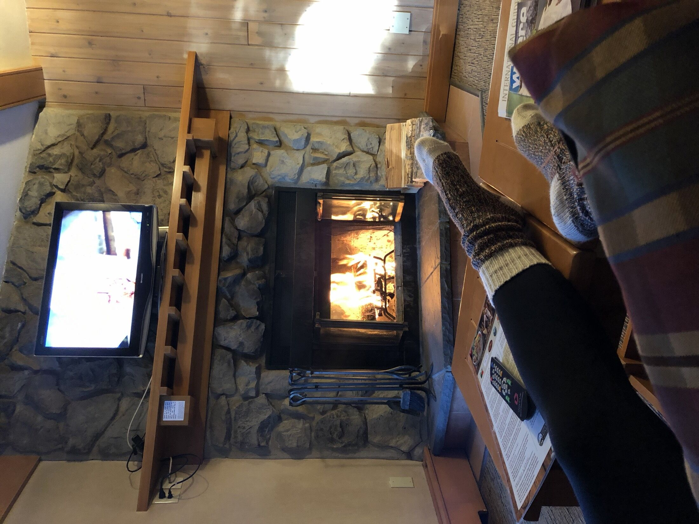

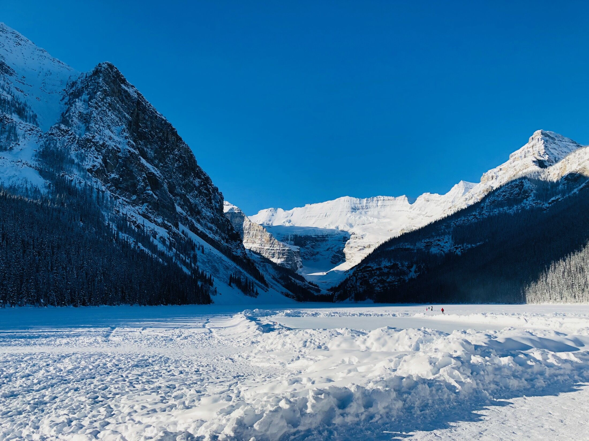

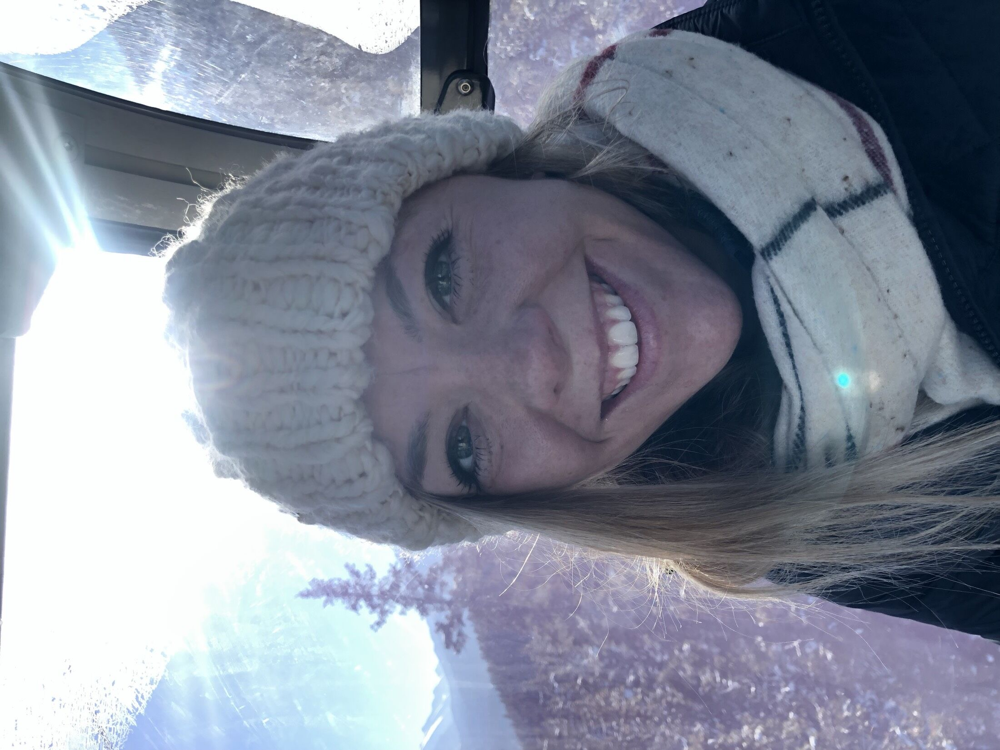

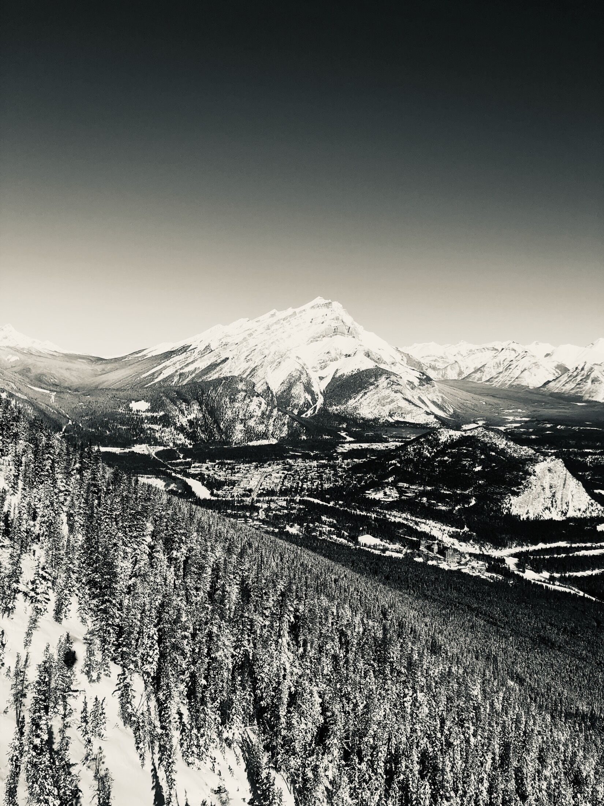

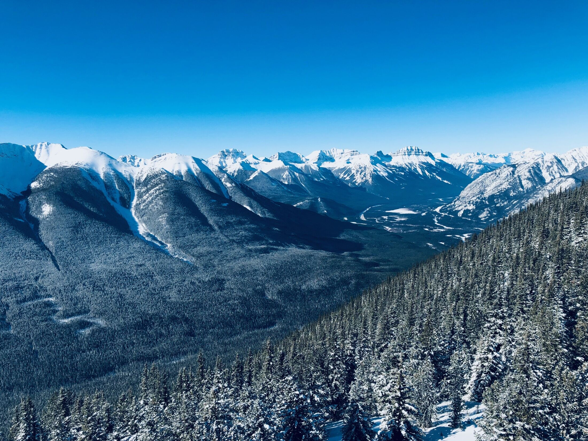

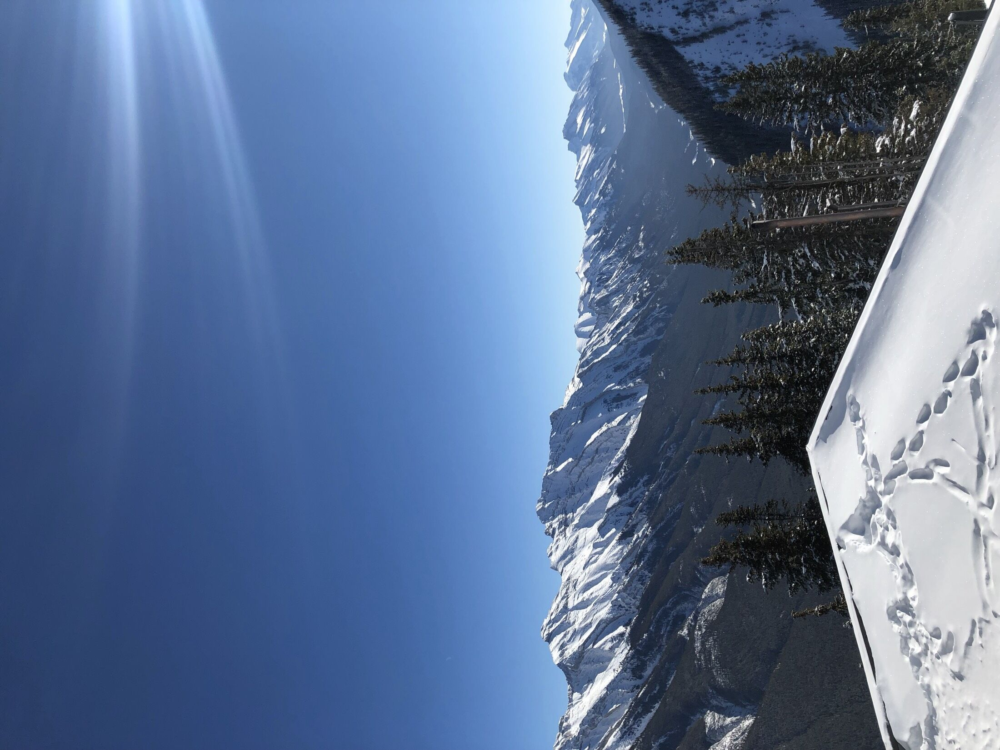

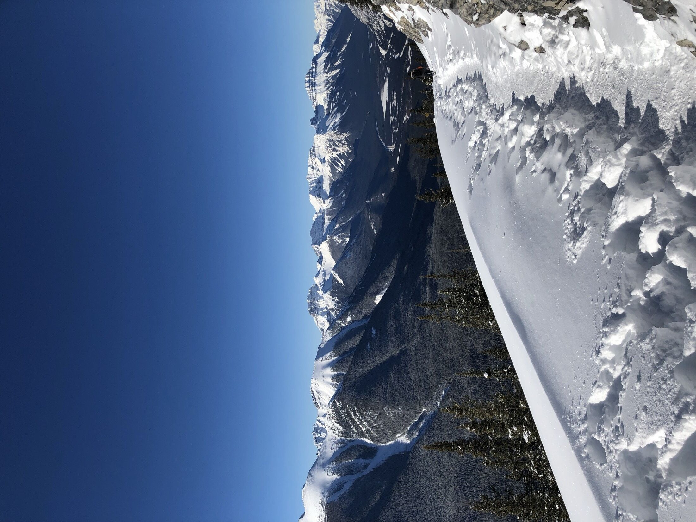

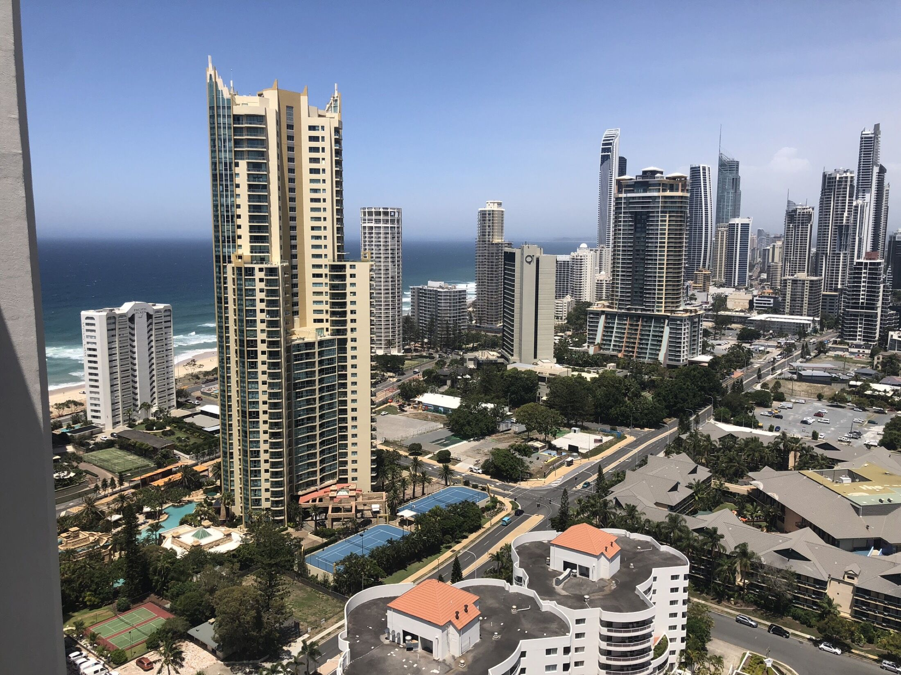

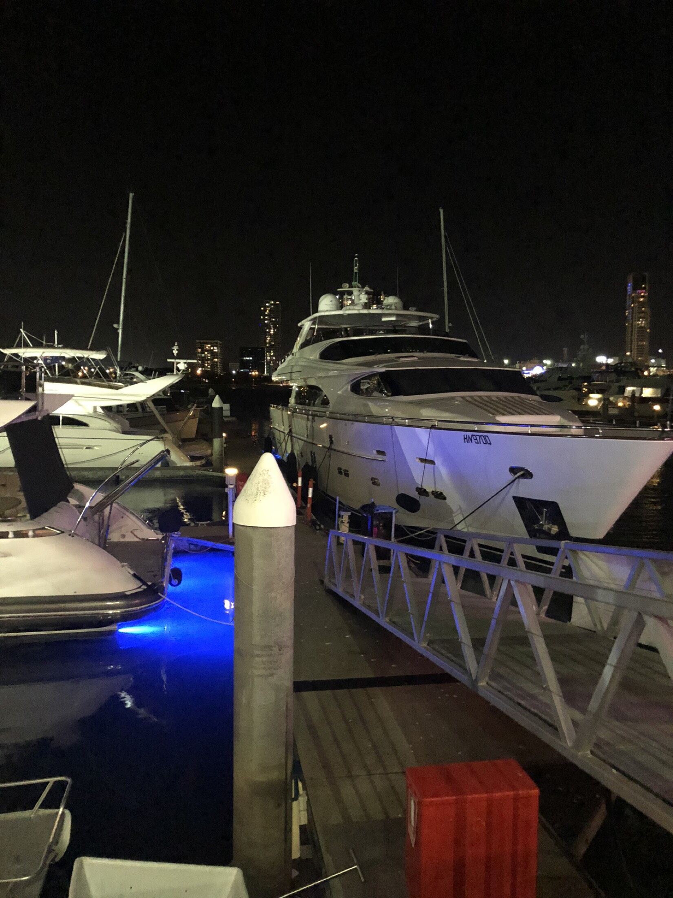

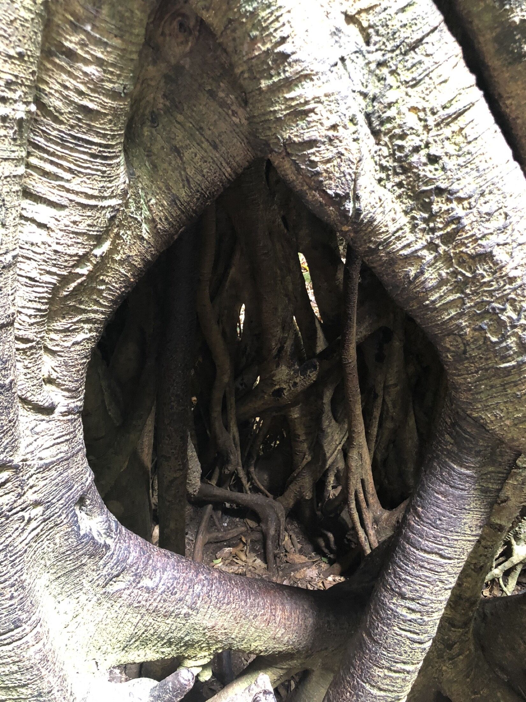

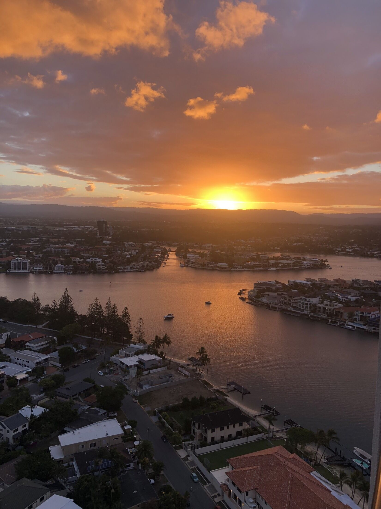
