<!--
  Auto-scaffolded from 276 photos taken
  2017-05-26 – 2017-06-01 (7 days).
  Cities: Barcelona, Brooklyn, Collbató, New York, Monistrol de Montserrat, El Prat de Llobregat.
  Write the story below; add alt text inside the  brackets for captions.
-->

TODO: Write about Barcelona.

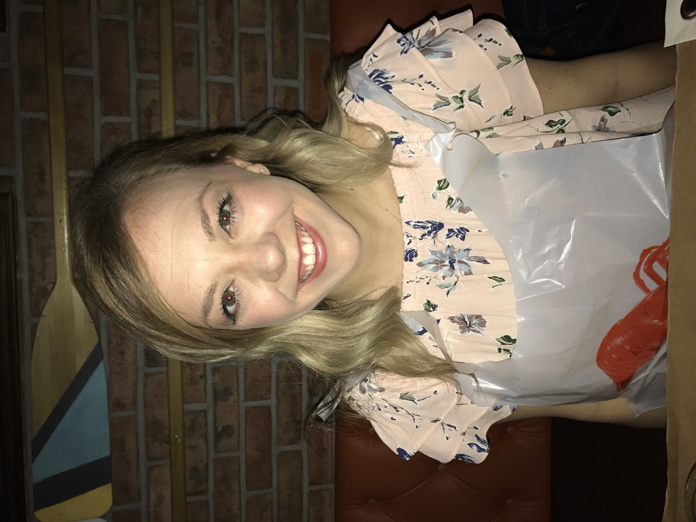

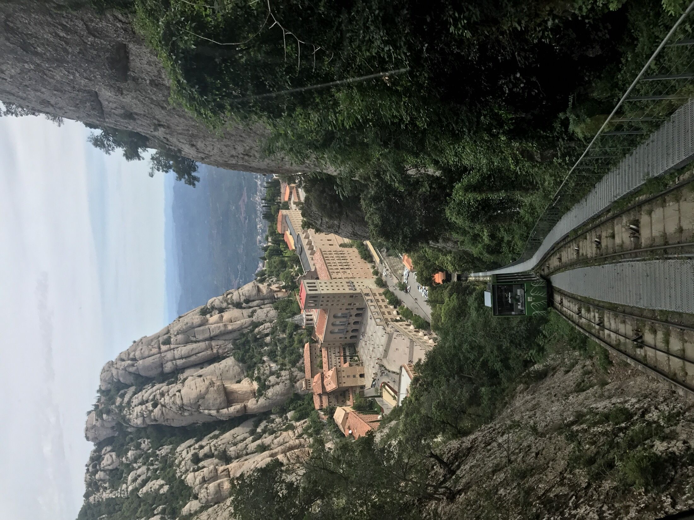

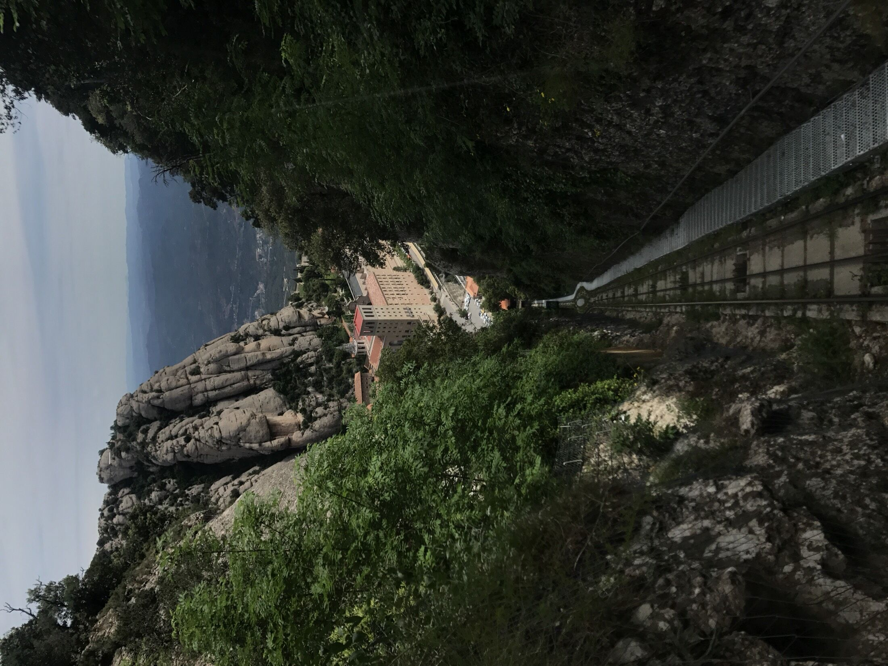

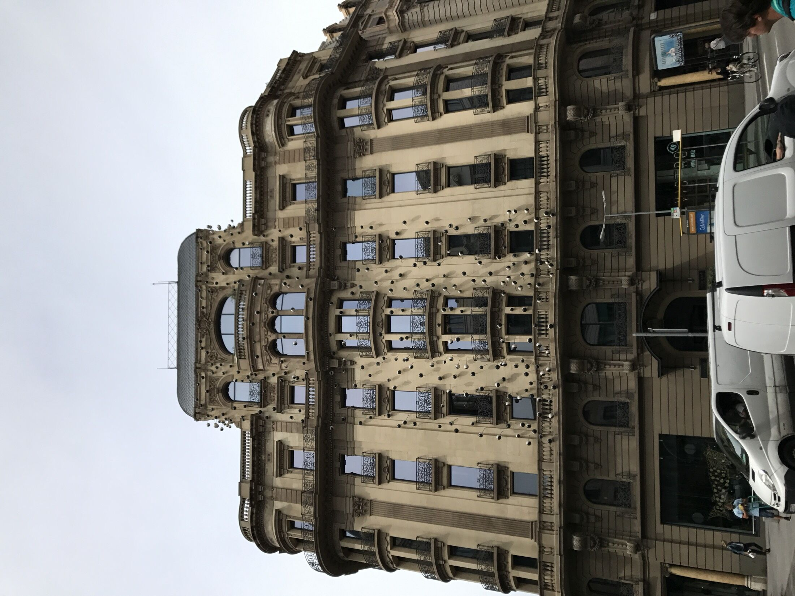

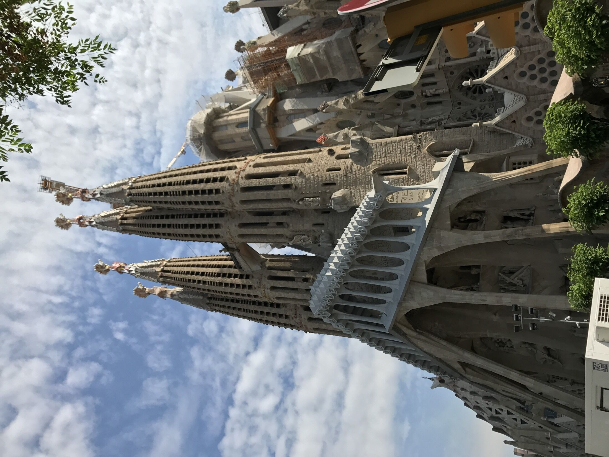

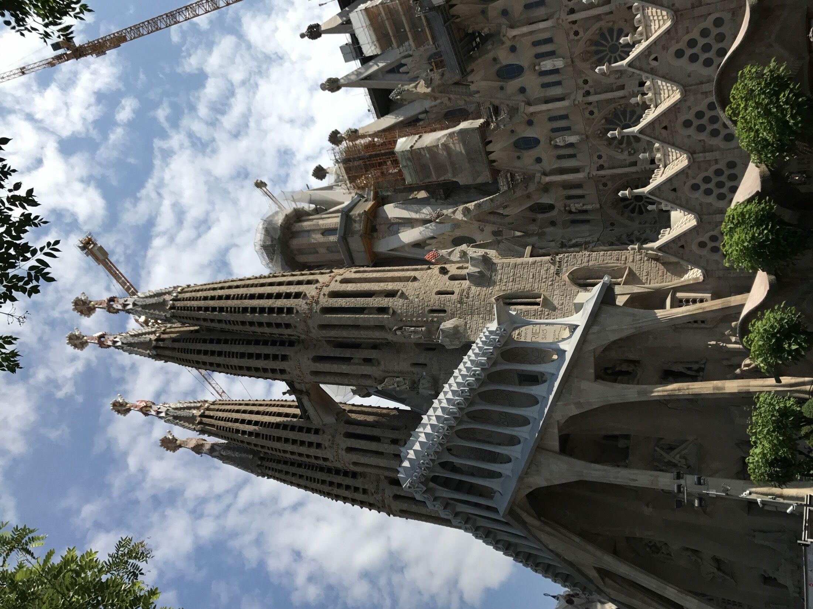

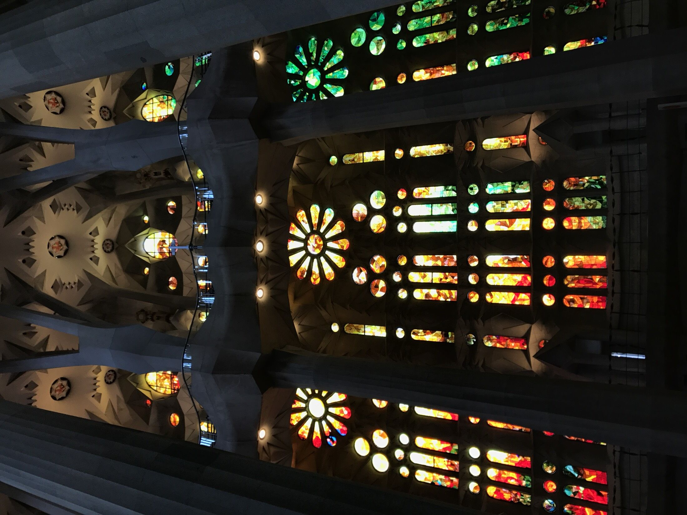

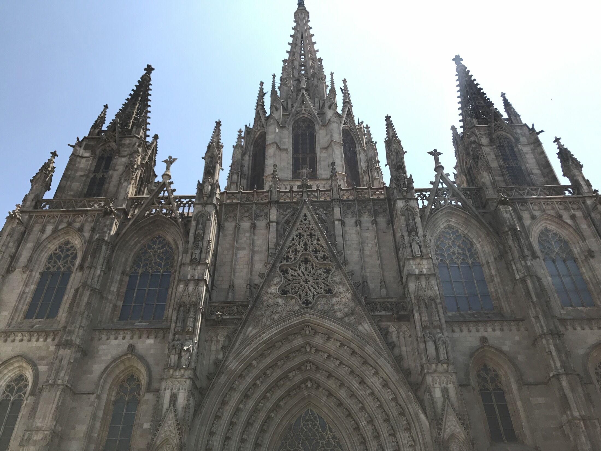

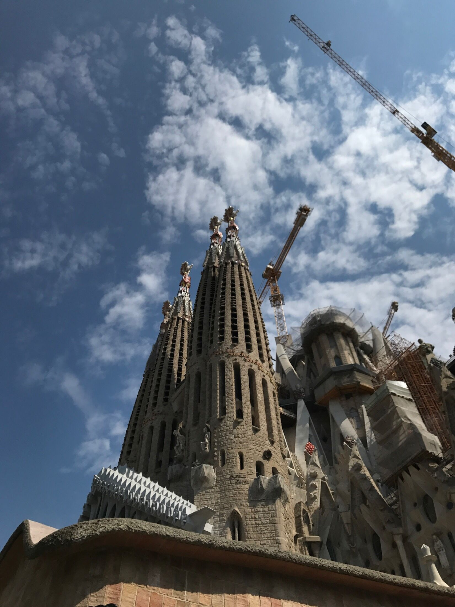

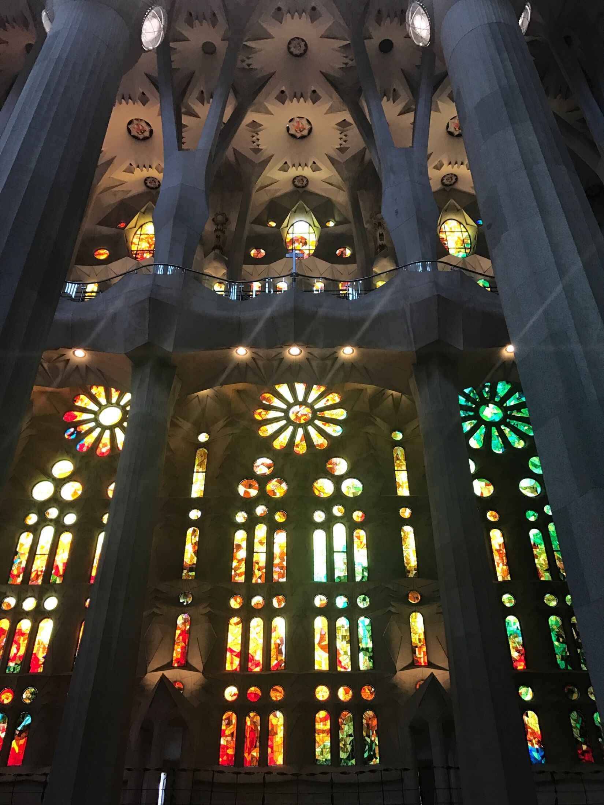

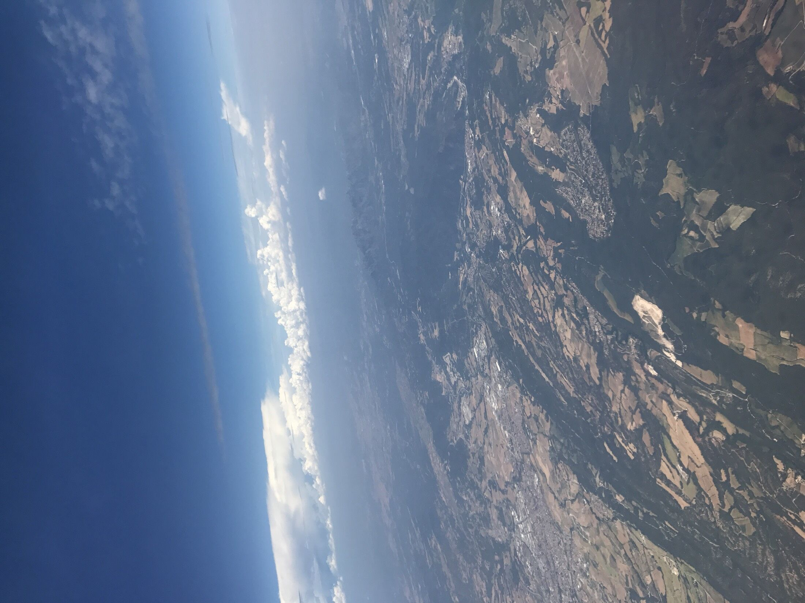
