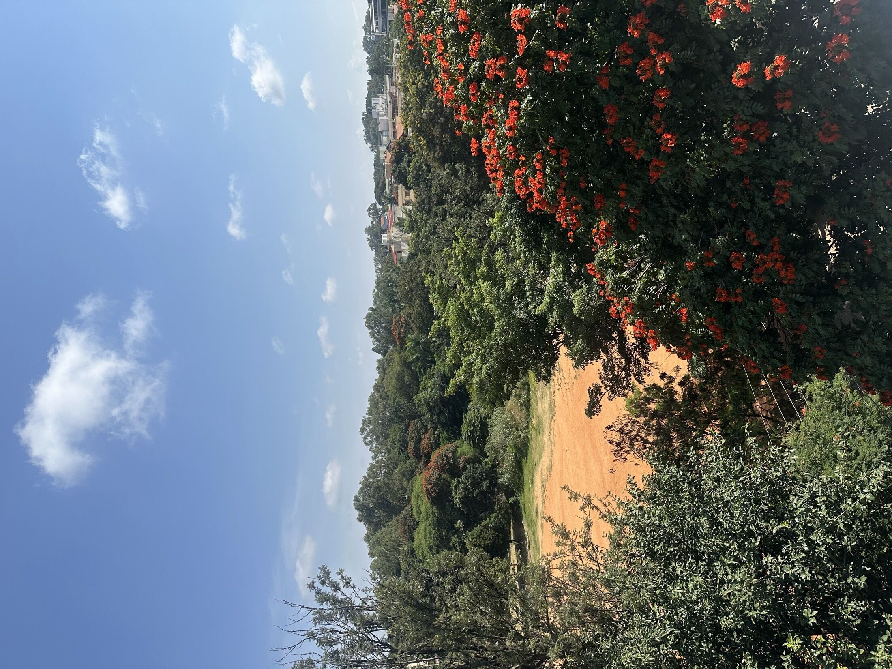
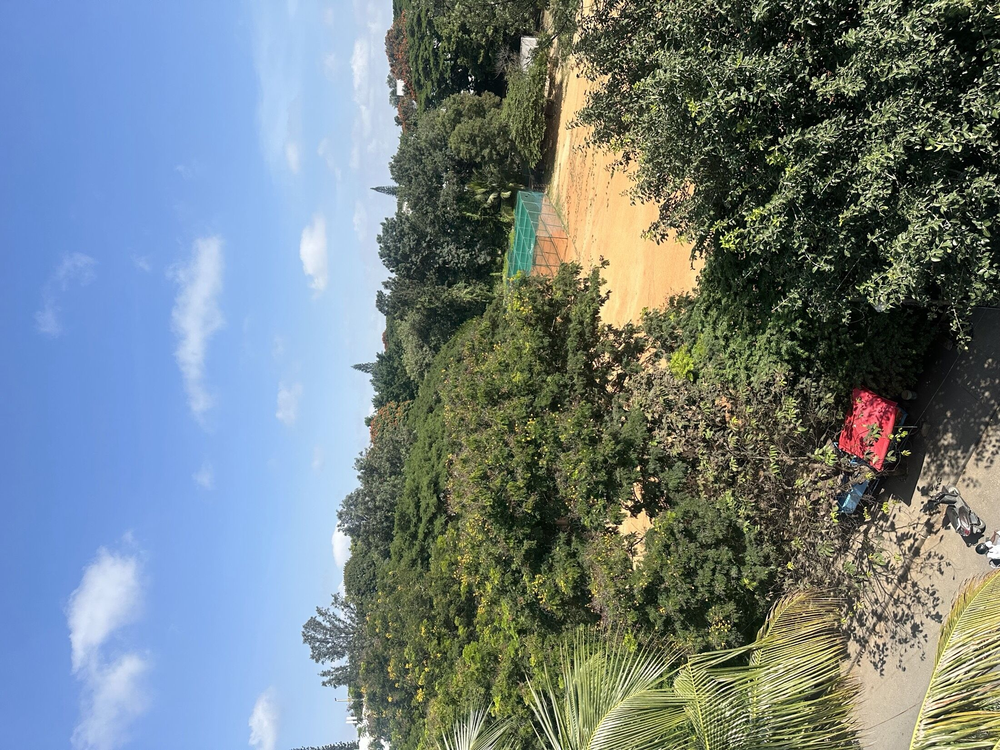
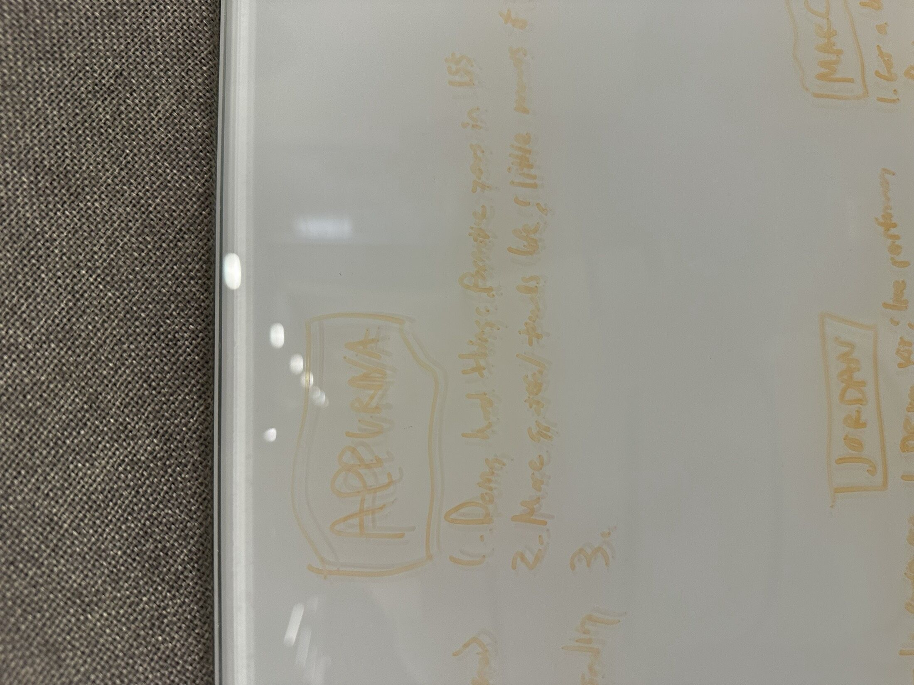
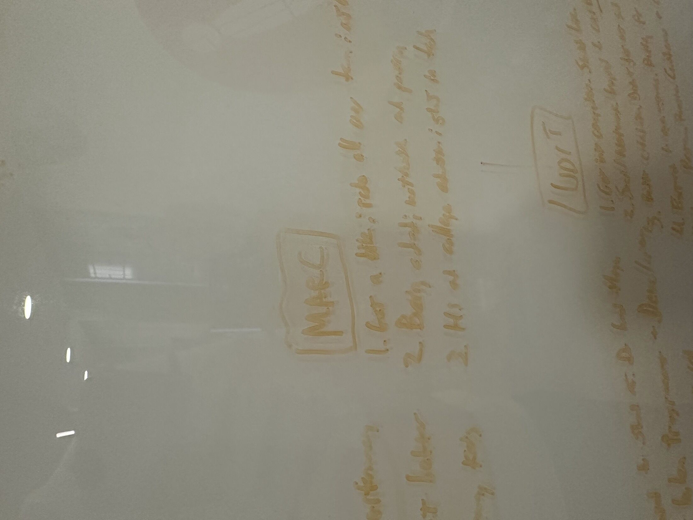
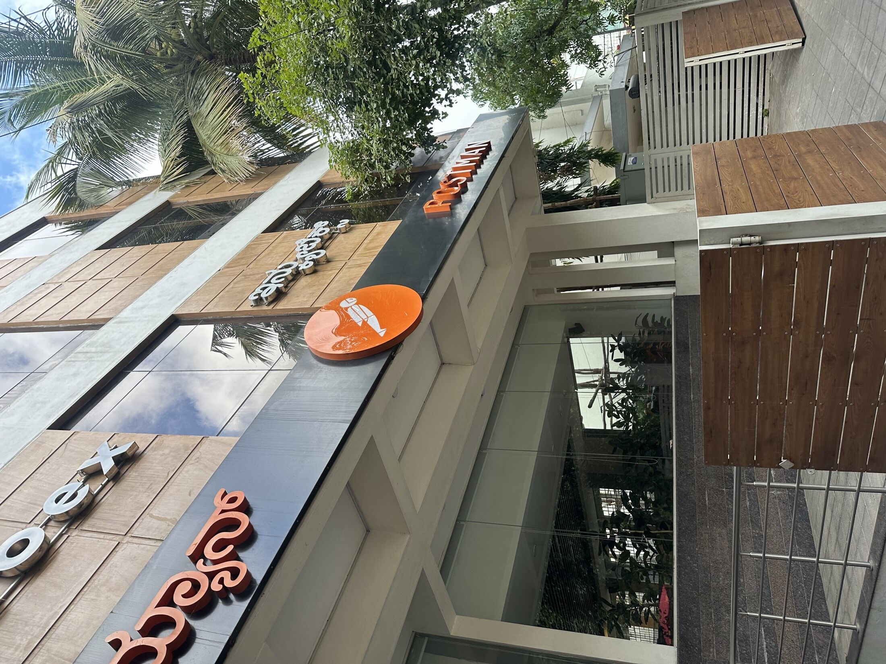
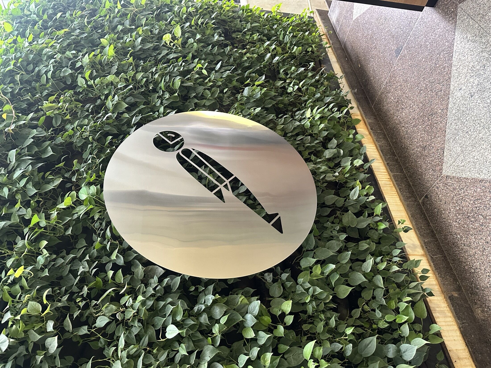
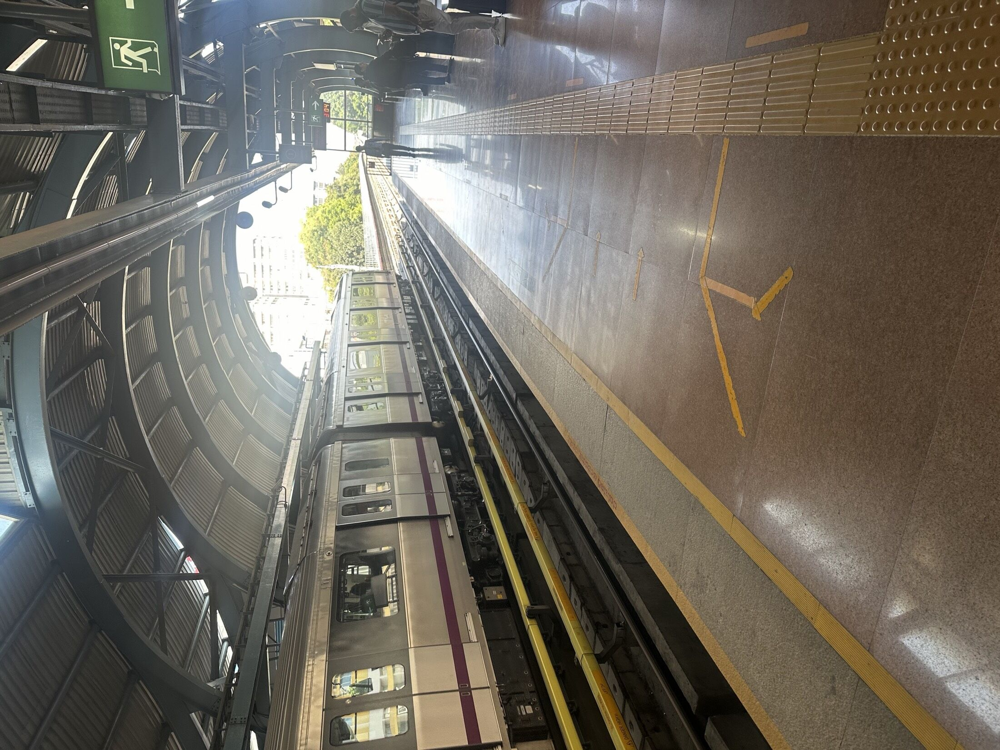

<!--
  Auto-scaffolded from 70 photos taken
  2024-09-14 – 2024-09-21 (8 days).
  Cities: Bengaluru Urban, Bengaluru, Narita.
  Write the story below; add alt text inside the  brackets for captions.
-->

TODO: Write about Bengaluru Urban.

