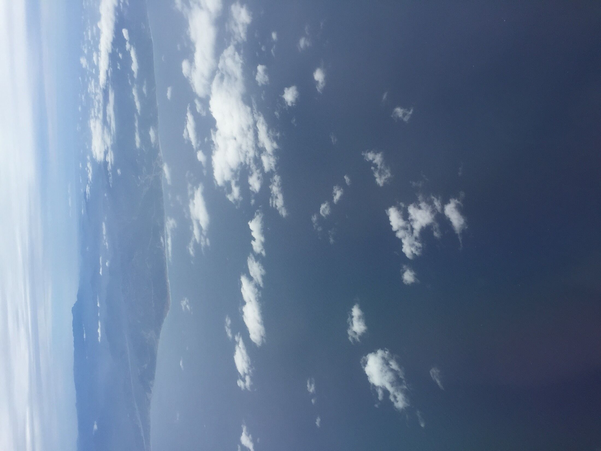
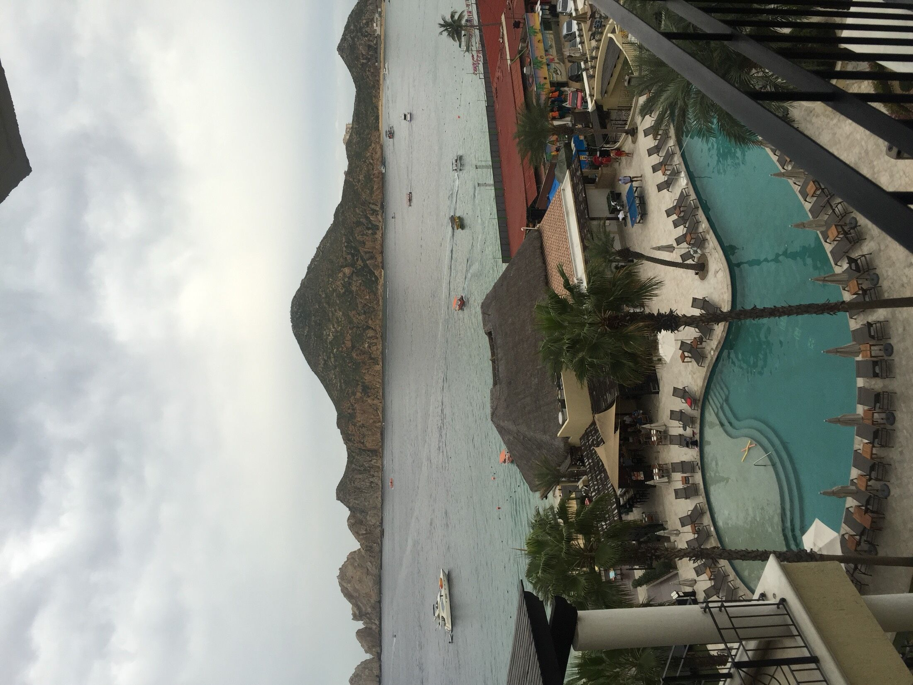
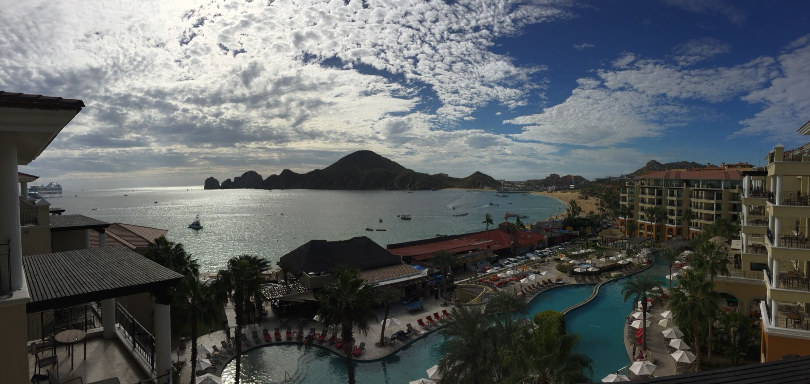
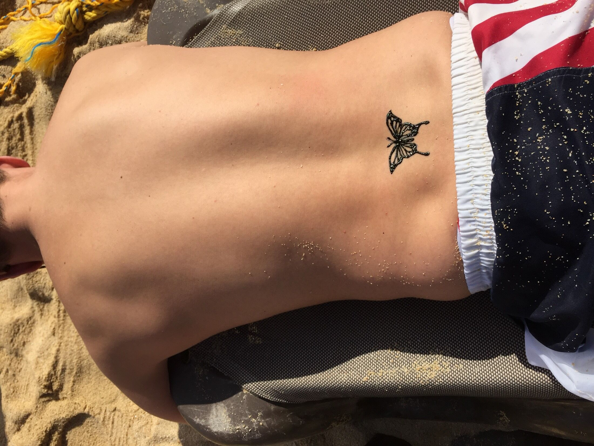
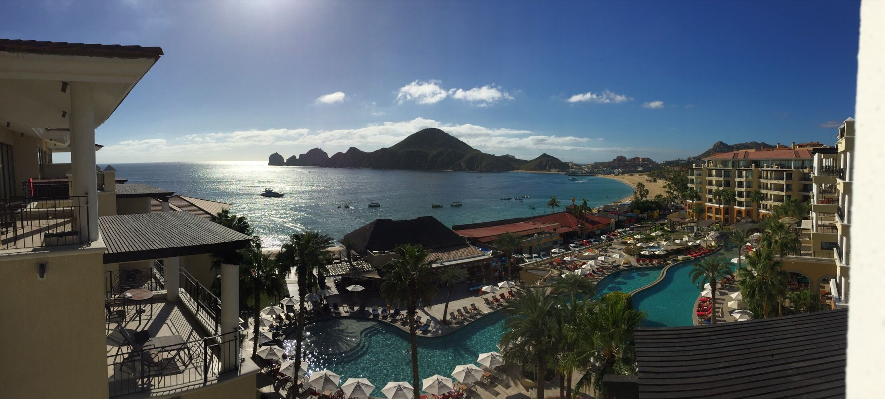
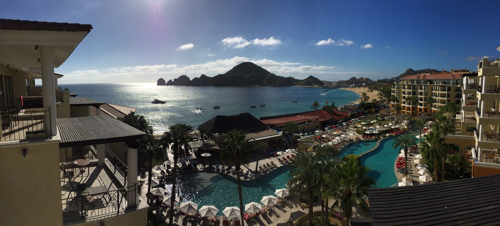

<!--
  Auto-scaffolded from 6 photos taken
  2016-01-01 – 2016-01-03 (3 days).
  Cities: Cabo San Lucas, La Paz.
  Write the story below; add alt text inside the  brackets for captions.
-->

TODO: Write about Cabo San Lucas.

