Five years with the best wife, friend, and mom ever: Maggie! We started our journey with our wedding (although the reality is that we'd known for a long time before then we'd found our other half) on June 12th, 2021 just a month or so after the vaccines had been released with a smaller wedding party than we had originally planned for our original wedding date (August 8th, 2020; postponed due to the pandemic!).

It was the best day ever, and every day after has only generally trended upwards. We've welcomed two beautiful children (Noah: three years old, Emilia: one year old) and we bought a house in San Francisco in 2022.

## Maggie

Maggie has been my rock over the past five years. We've had our ups and downs (life as parents was a real adjustment and challenged us!) but I believe our partnership has never been stronger. She's become such a confident and assertive professional and a truly amazing mom to our two kids. 

Between all of that, she still manages to find time to make everyone in our lives -- including me of course! -- feel special, appreciated, and valued. I don't know how she does it at all, but that's just Maggie.

### Noah

Noah is who made us parents and has caused so much joy in our lives. He's our little wild man, but he's a bundle of fun and energy and it's been so rewarding seeing his personality bloom and seeing him become such a great big brother. The biggest change this year for him was going to day care and it's helped quite a bit for him to play with other kids and be socialized. He's still a mildly feral animal but now a civilized one.

### Emilia

Emilia is our sweet, chill baby angel. She's so stoic, observant, and mild mannered. She has been showing a bit of a wild side with Noah though, letting him know when she is displeased loudly and proudly! She's still with our nanny Roverssy and gets to spend just about every day going to the park and hanging out with other kids. The good life!

## Sonoma

To celebrate our five year anniversary, we took our first night ever away from the kids and went to a nice hotel in Sonoma and treated ourselves to some alone time. The first night we went to an amazing restaurant Enclos (more below!) and then the second day we explored Sonoma square, did a wine tasting at a great winery we recently joined called Blue Farms, and then treated ourselves to a spa day at the hotel. 

We came back around 800PM that Friday evening just after the kids went down to still have a little time to unwind. I can't imagine a more perfect day, weekend, and time together to celebrate five of the best years of our lives.

<!-- Write about the trip here — where you stayed, what you ate, what it felt like to have a few days away. -->

---

## Enclos

Enclos is where we chose to go to celebrate our five years together. It's a two Michelin-star restaurant in Sonoma and was truly amazing, perhaps the best meal we've had ever.

I think what we both enjoyed most wasn't just that the food was stellar -- that was honestly more or less expected -- it was the little moments of surprise and delight, like when the quail was served the staff would wait a bit and then surprise us with a bonus course of truly excellent stock and dumplings or later when there was a bonus dessert.

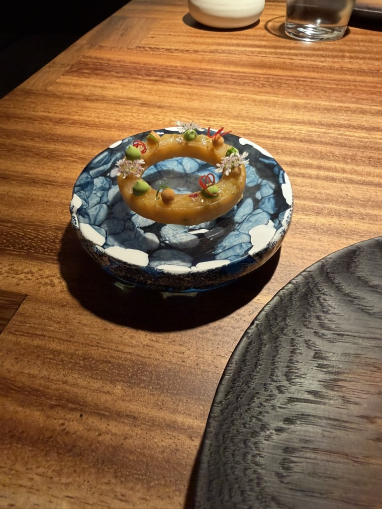

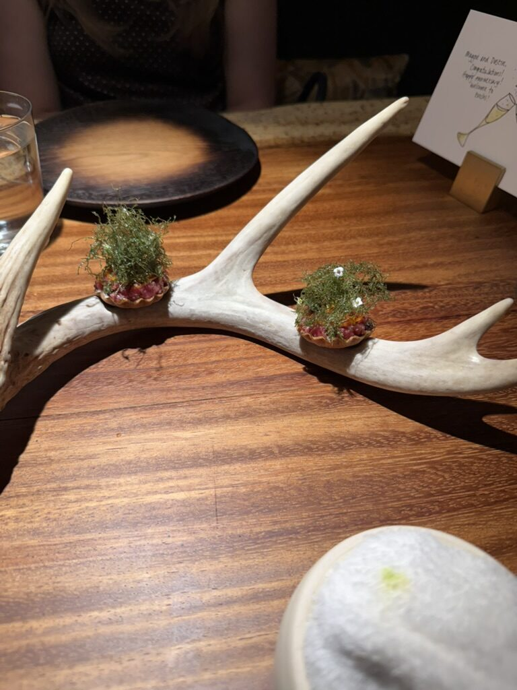

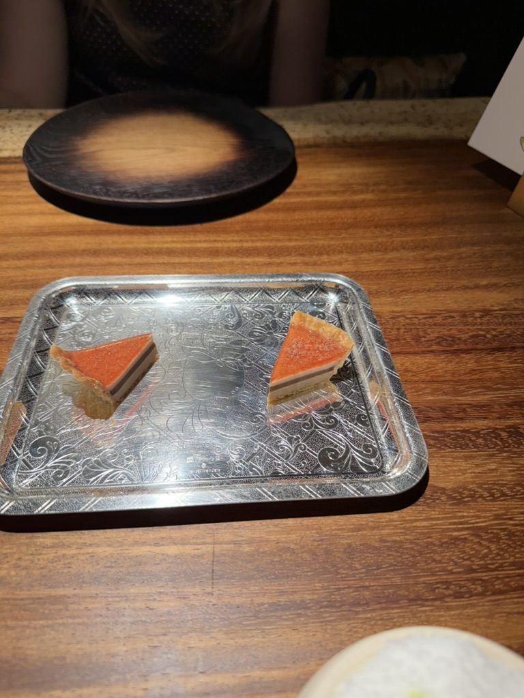

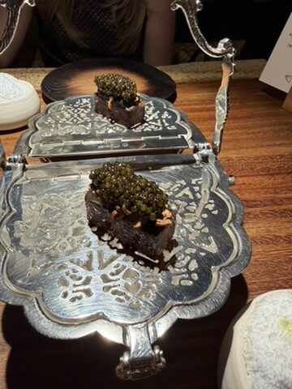

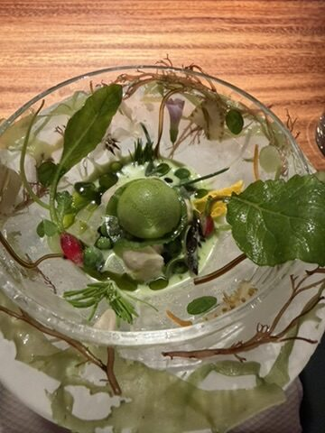

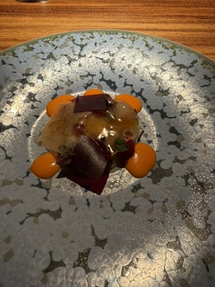

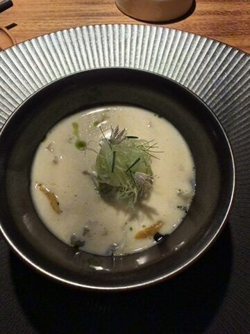

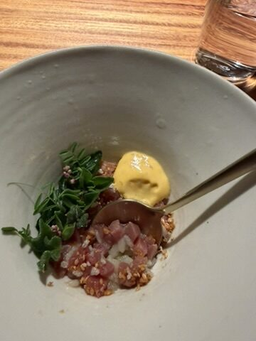

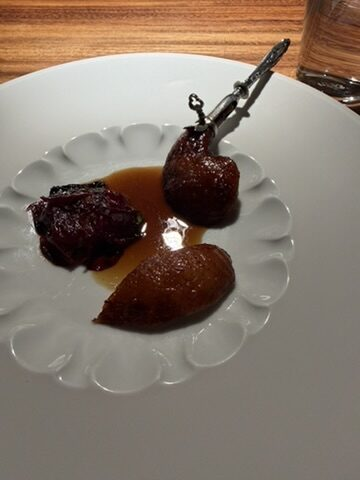

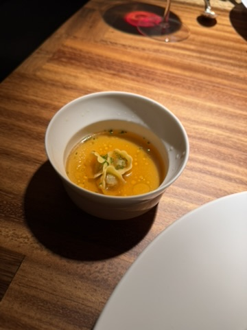

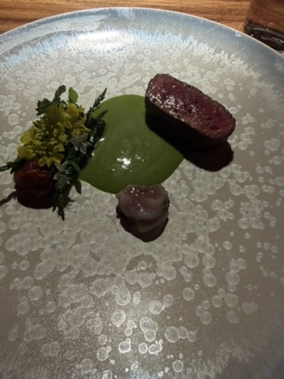

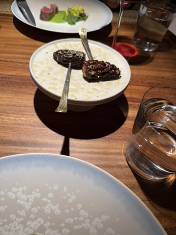

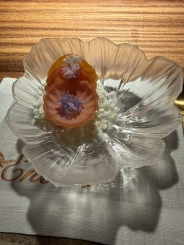

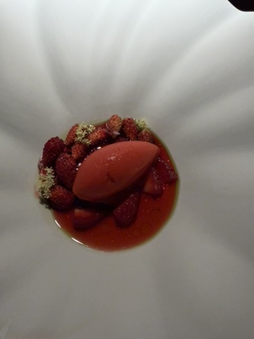

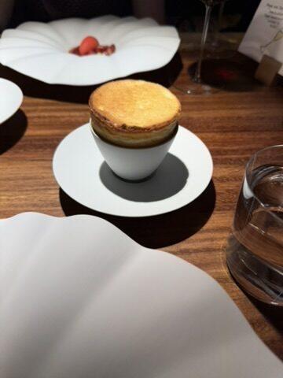

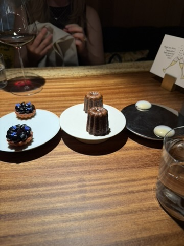

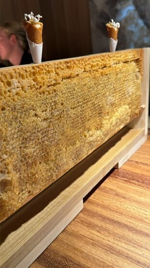

### To the next five

I don't know what the next five will hold but I know there will be some constants: Maggie continuing to be the best, Noah growing into his own but remaining his precocious self, and I'm so eager to see Emilia start to develop her own personality and to get to see the spunky little girl that she'll become.

Can't wait for it all.
