<!--
  Auto-scaffolded from 535 photos taken
  2017-09-18 – 2017-09-24 (7 days).
  Cities: Grainau, Munich, Oberding, Dachau.
  Write the story below; add alt text inside the  brackets for captions.
-->

TODO: Write about Grainau.

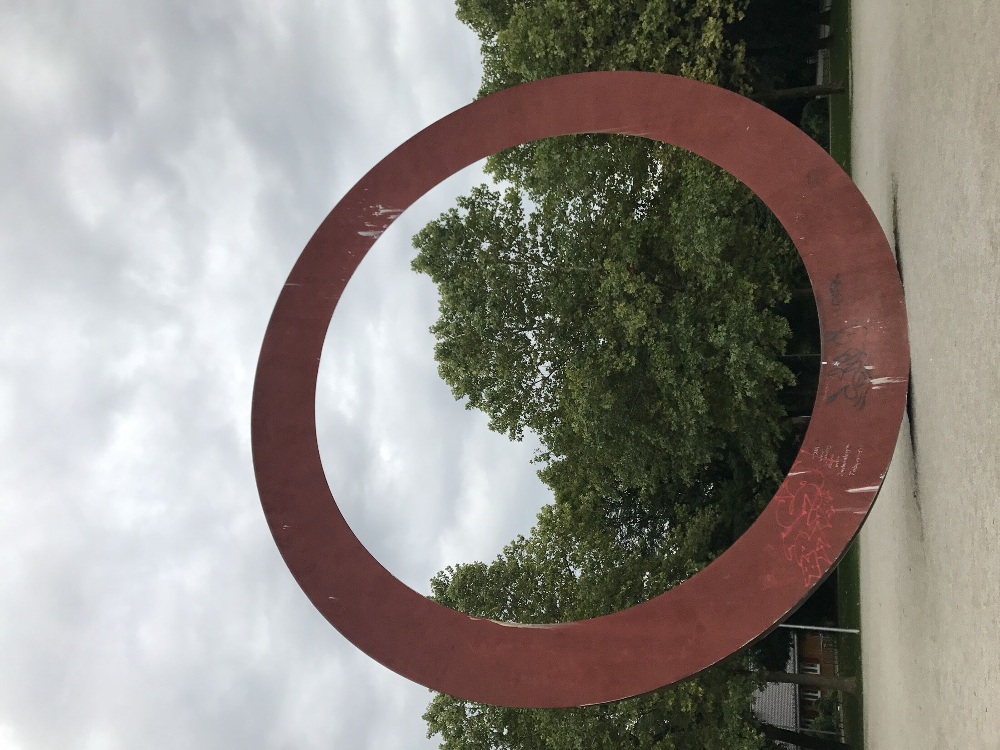

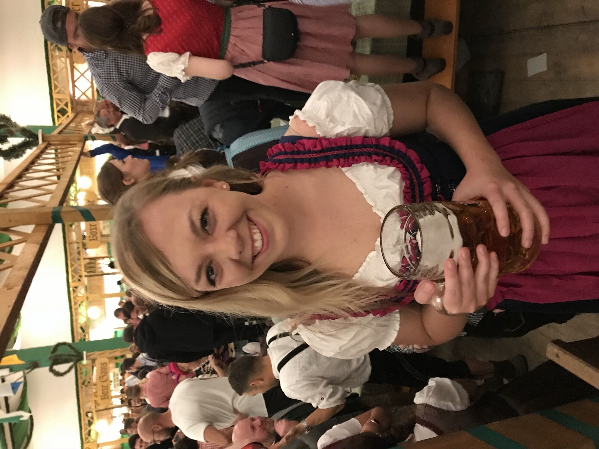

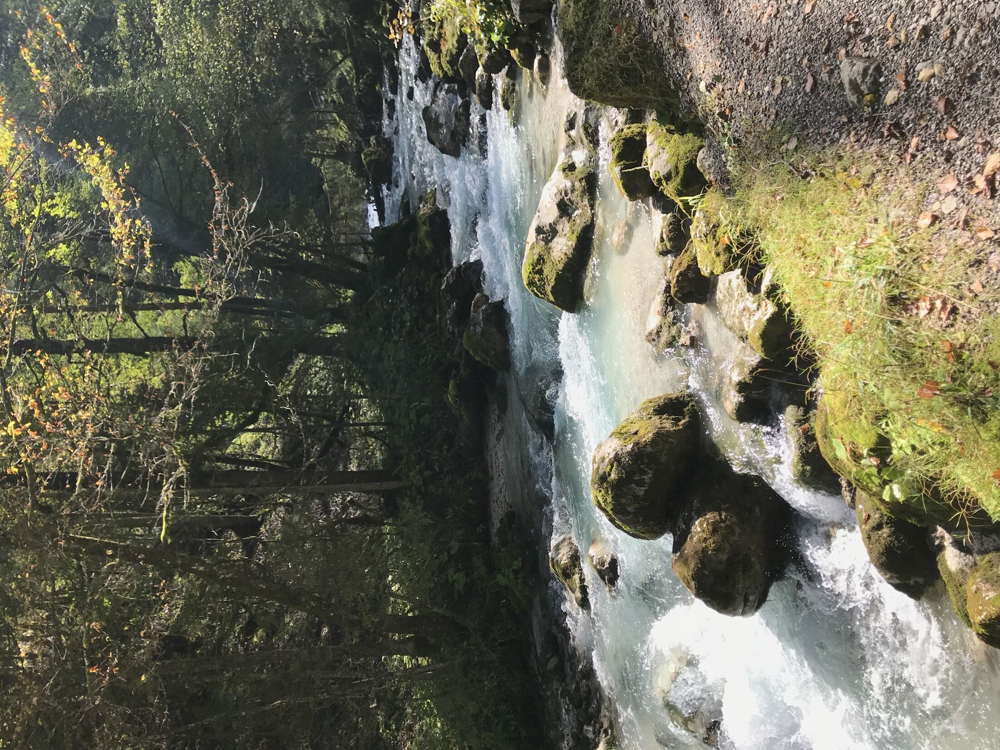

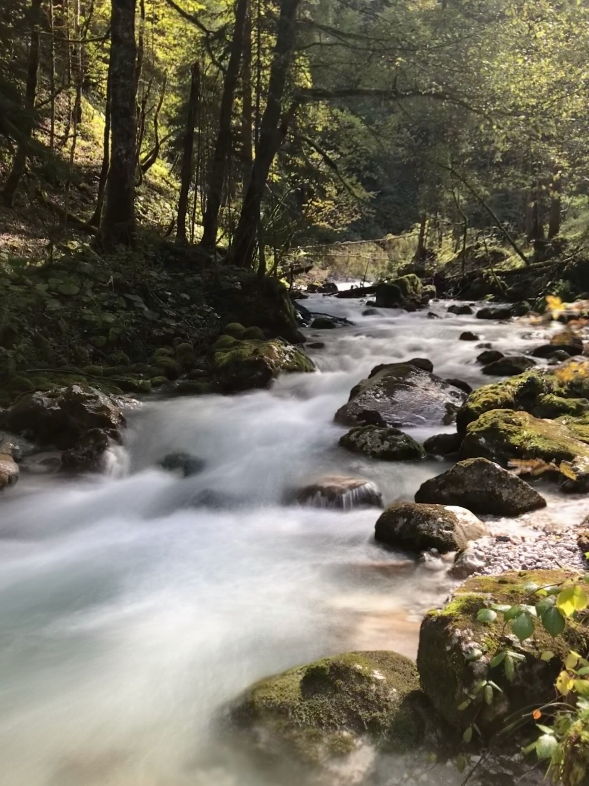

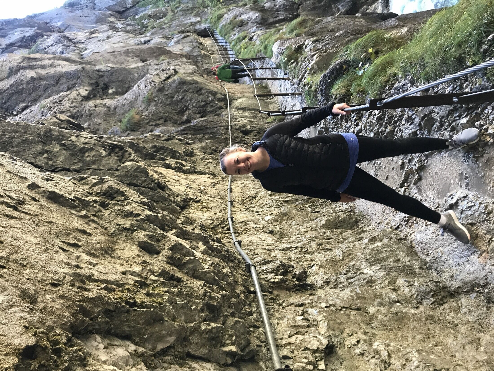

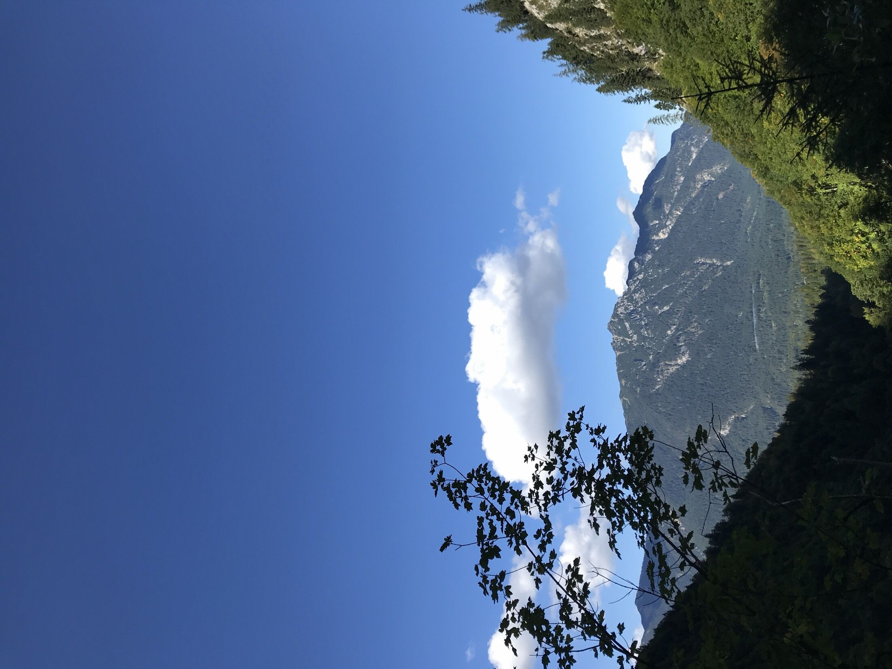

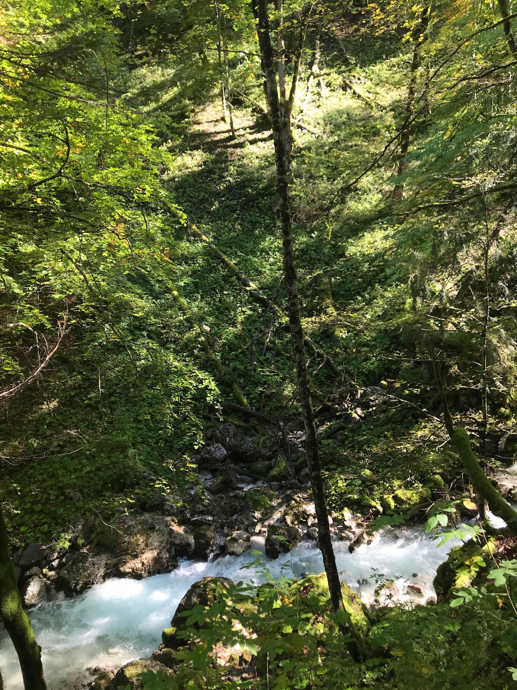

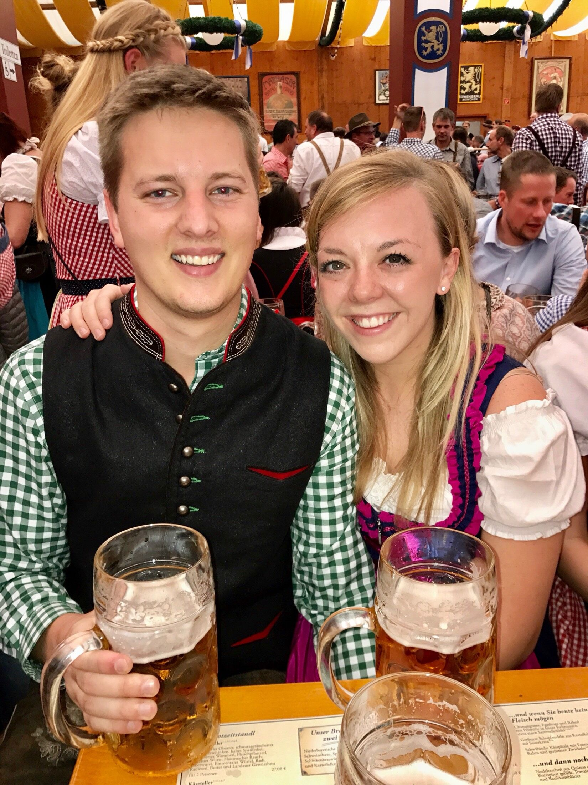

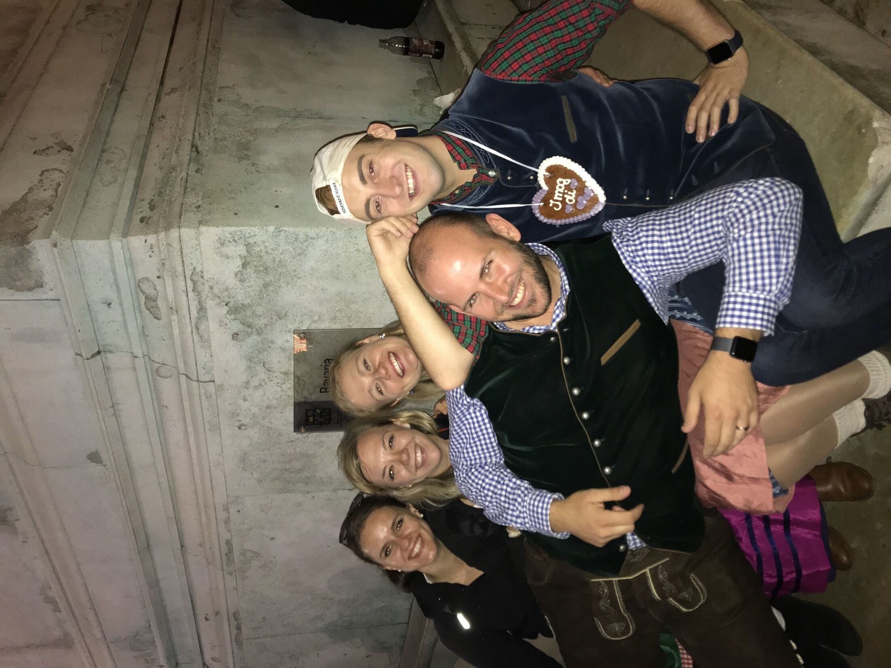

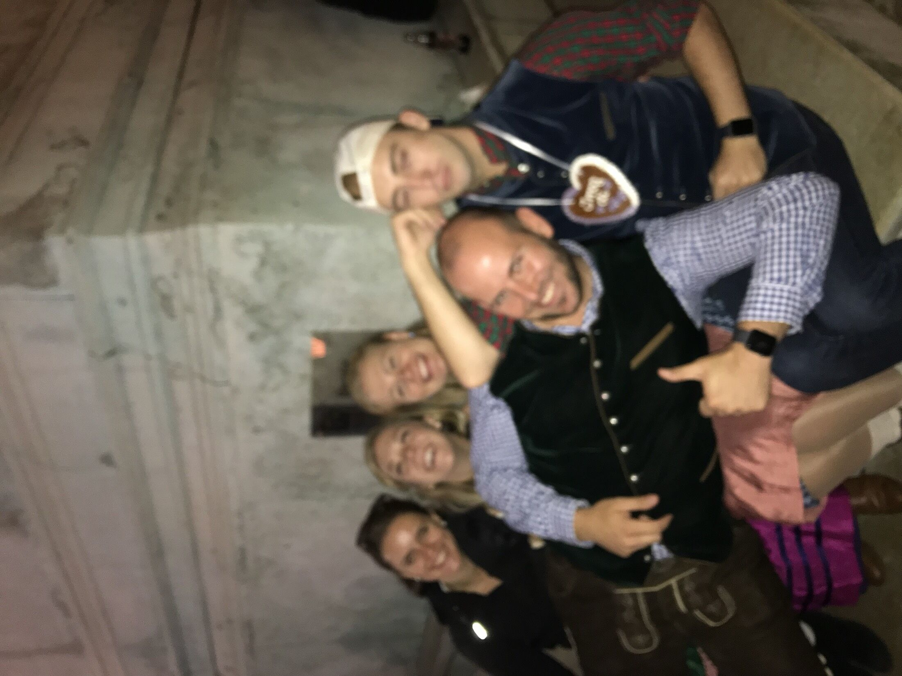

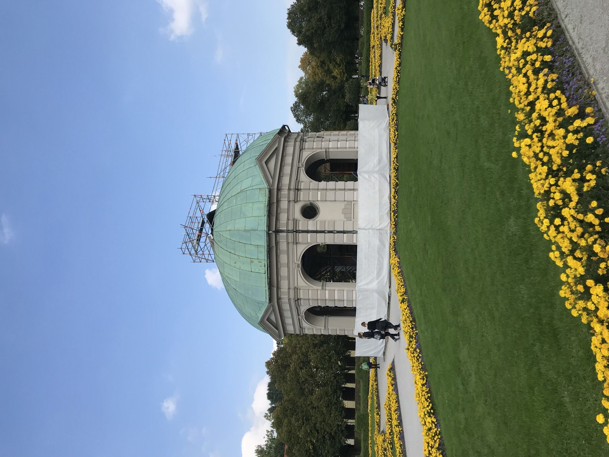
