<!--
  Auto-scaffolded from 139 photos taken
  2019-04-23 – 2019-04-28 (6 days).
  Cities: Helsinki, Schiller Park, Vantaa, Frankfurt.
  Write the story below; add alt text inside the  brackets for captions.
-->

TODO: Write about Helsinki.

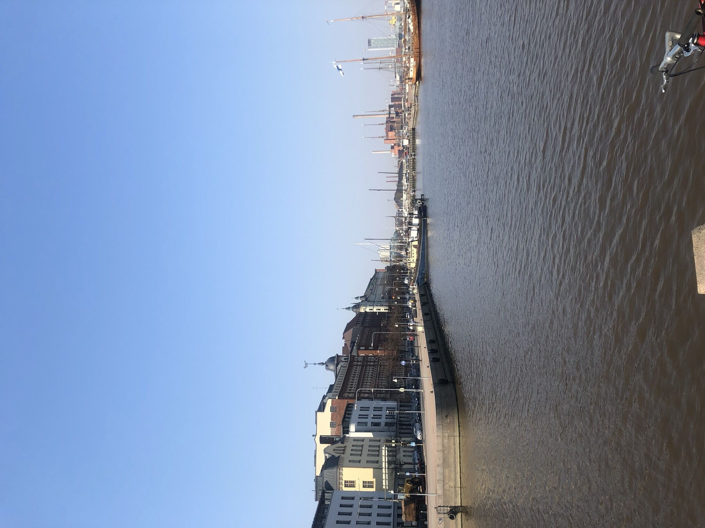

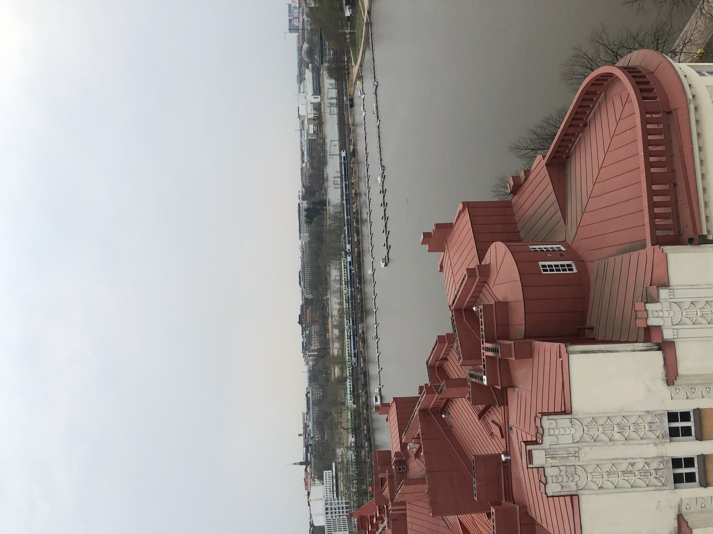

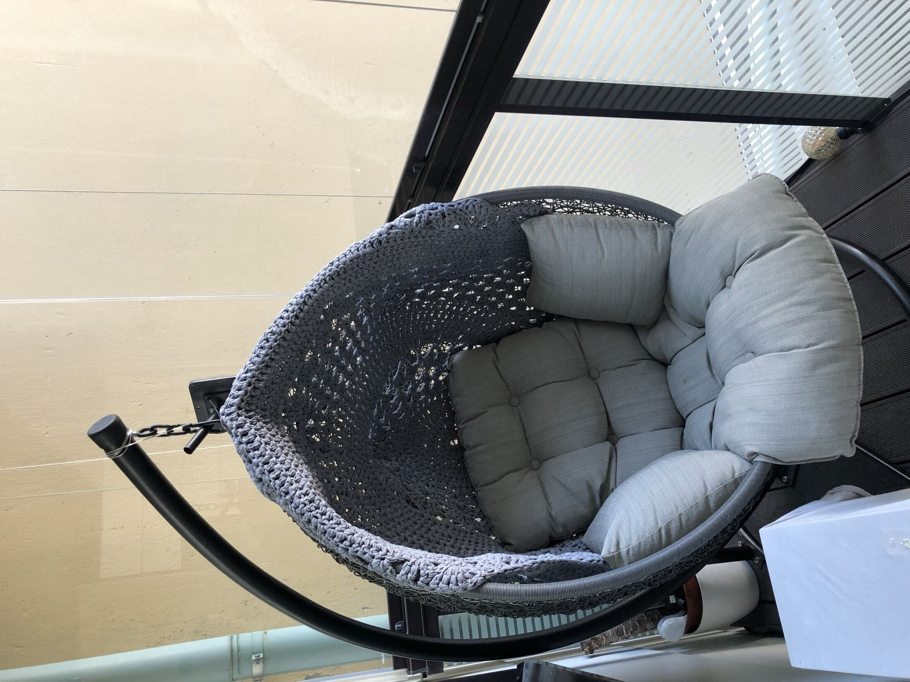

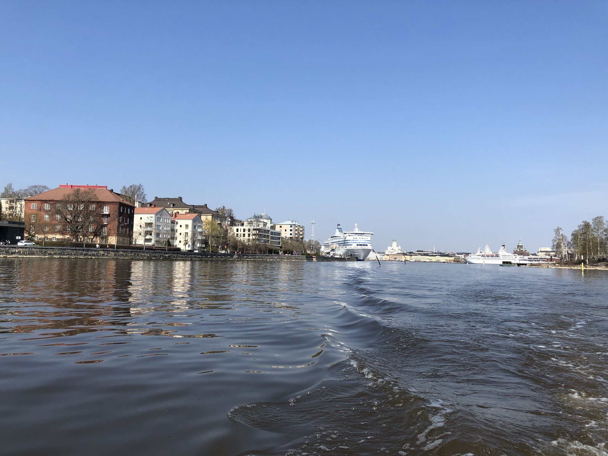

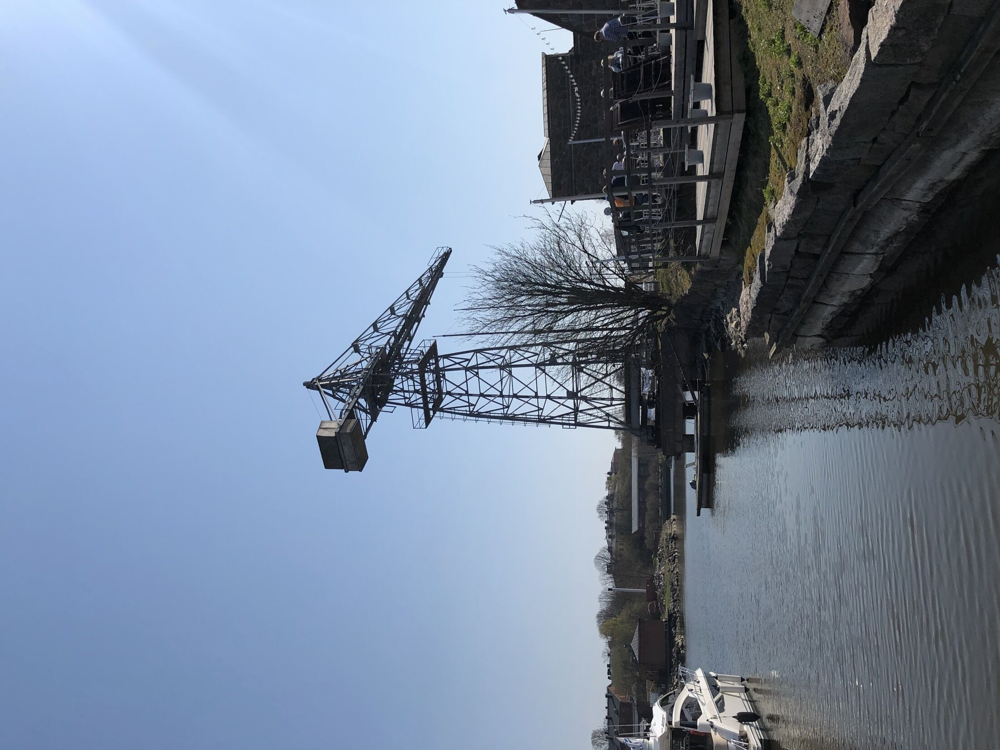

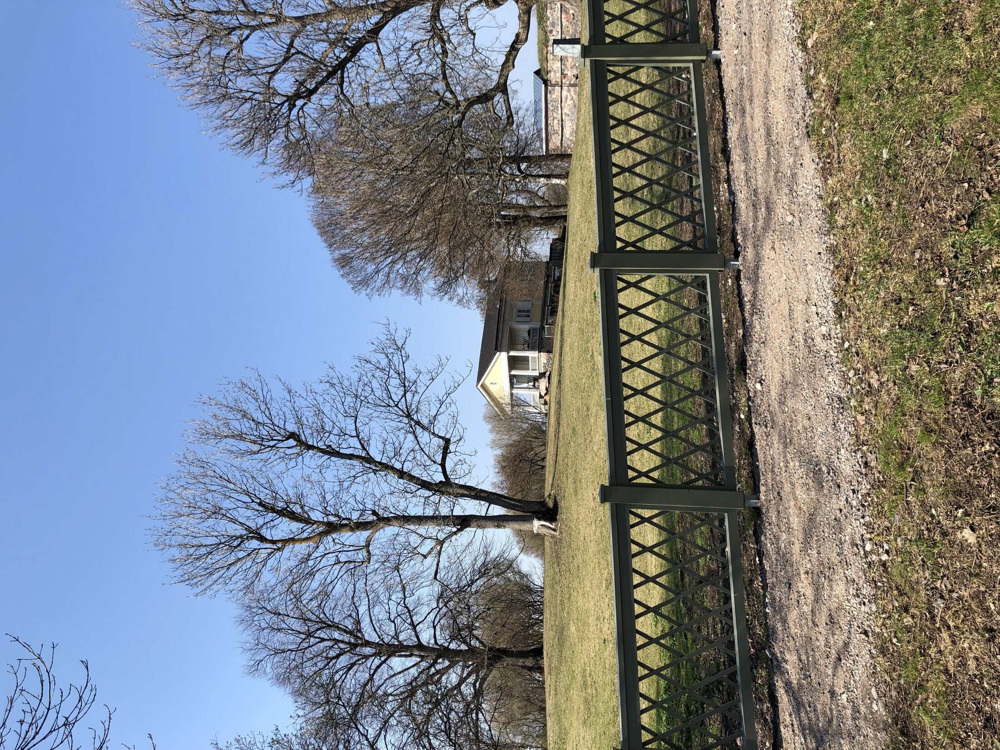

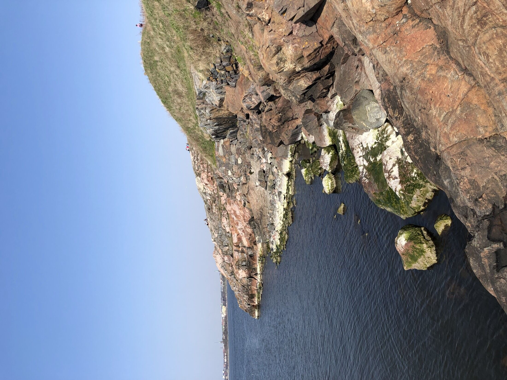

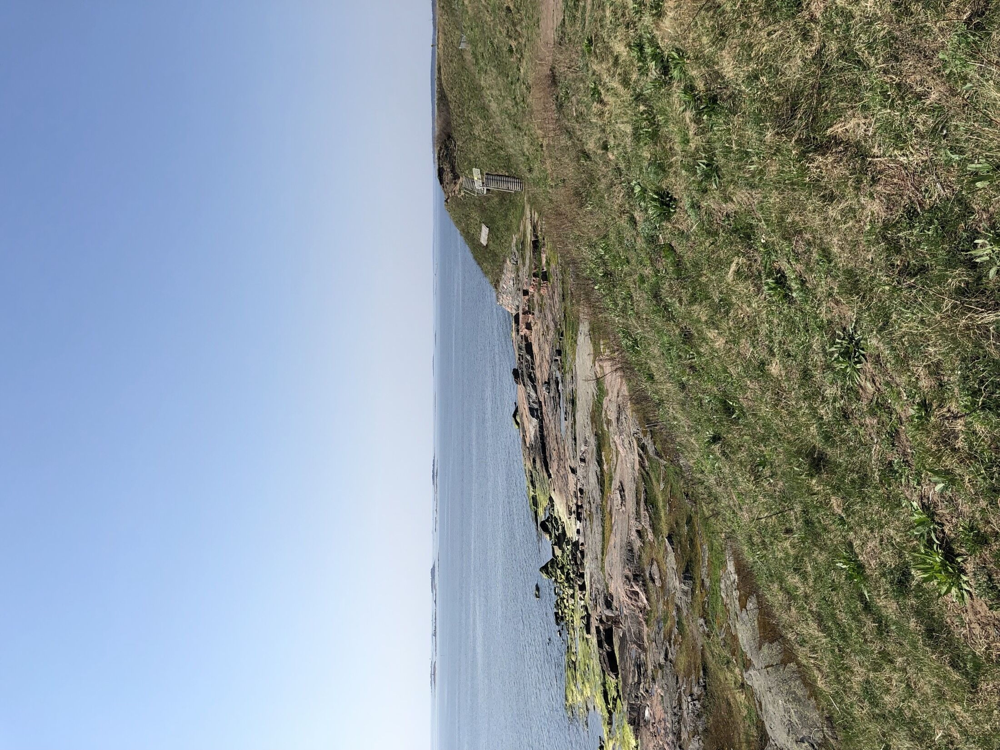

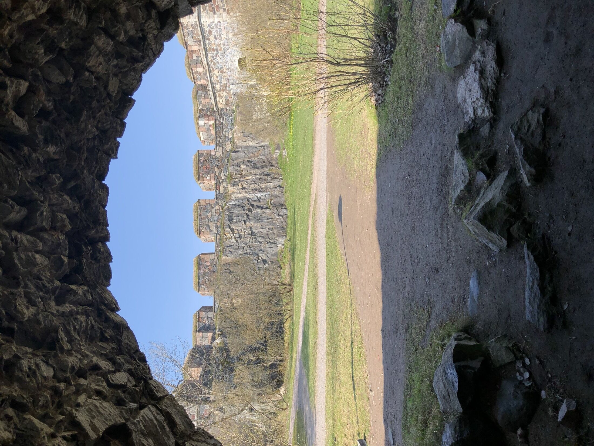

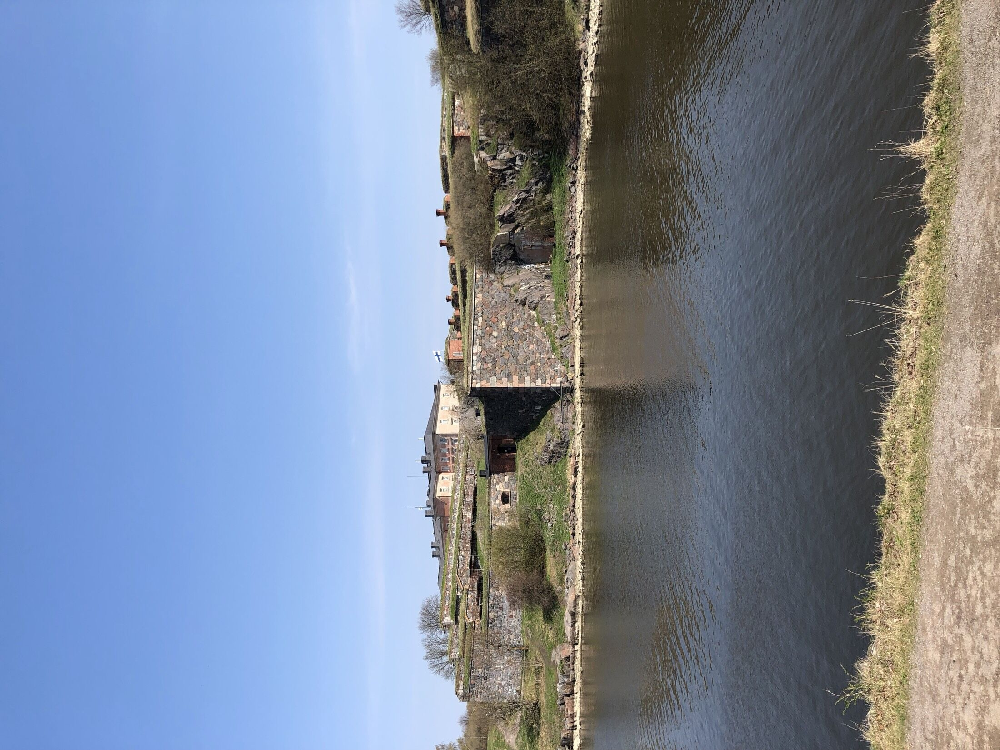

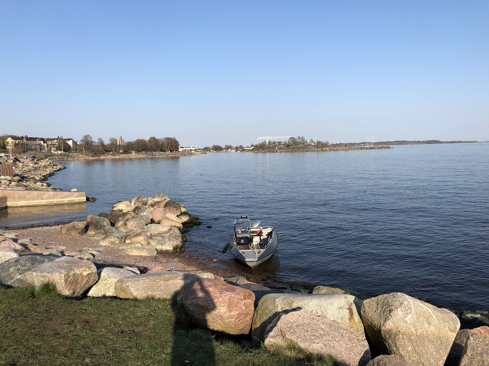

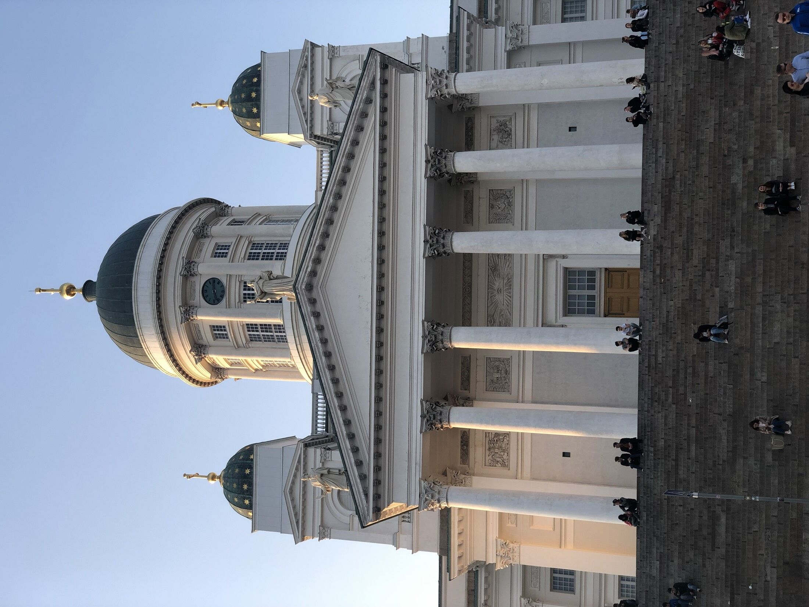
