<!--
  Auto-scaffolded from 158 photos taken
  2021-09-17 – 2021-09-26 (10 days).
  Cities: London, Windsor.
  Write the story below; add alt text inside the  brackets for captions.
-->

TODO: Write about London.

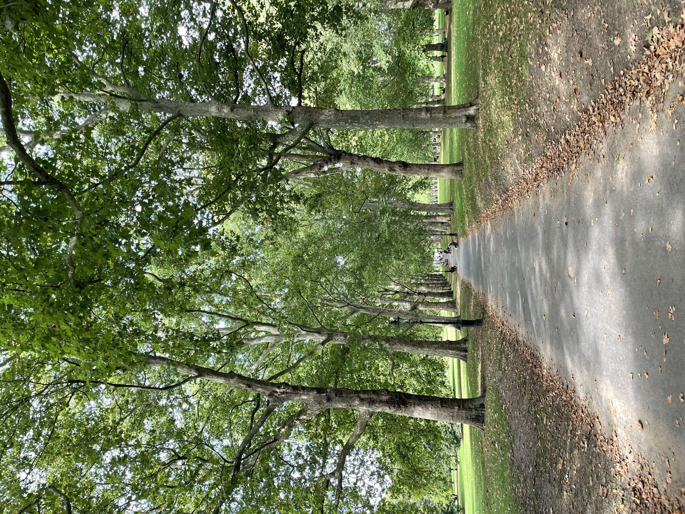

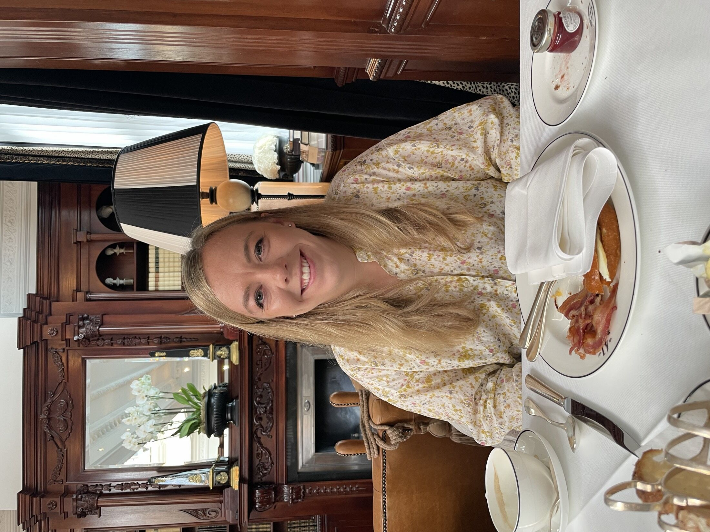

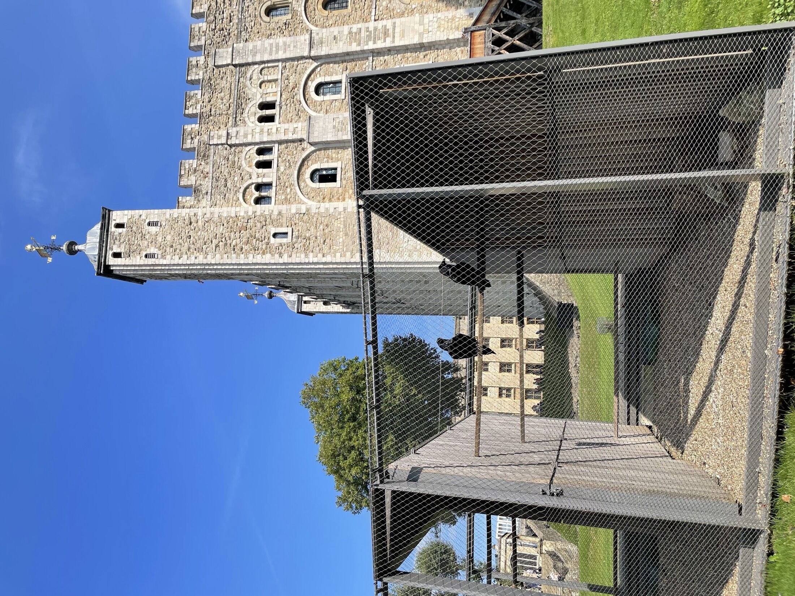

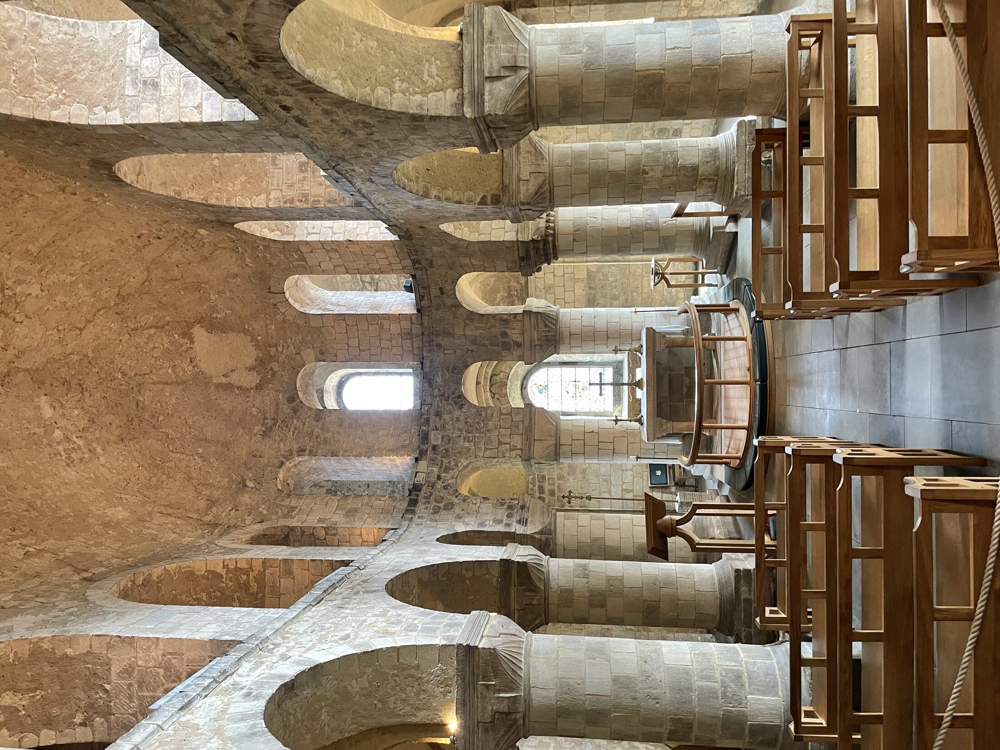

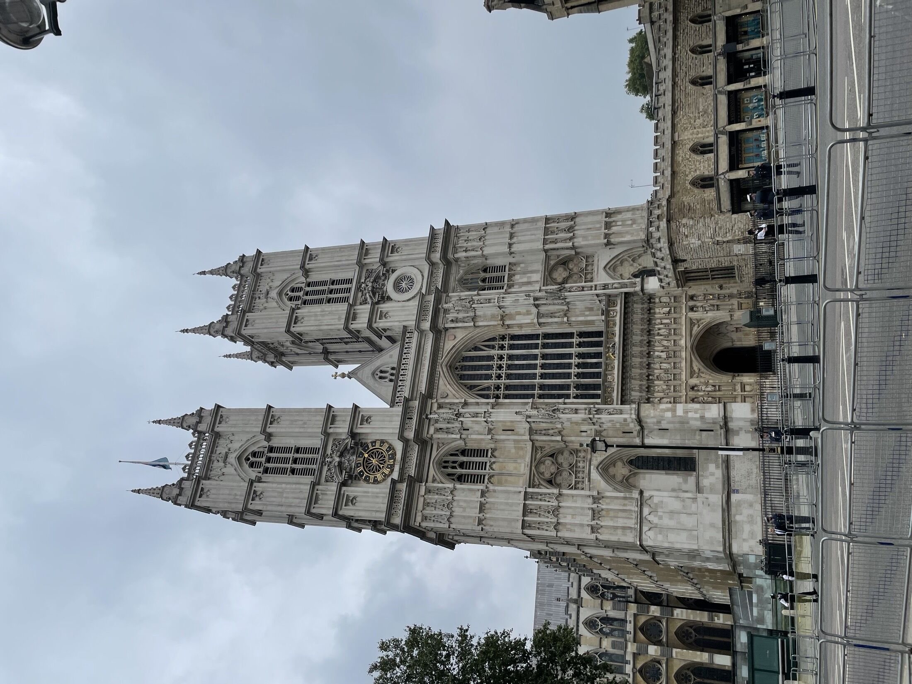

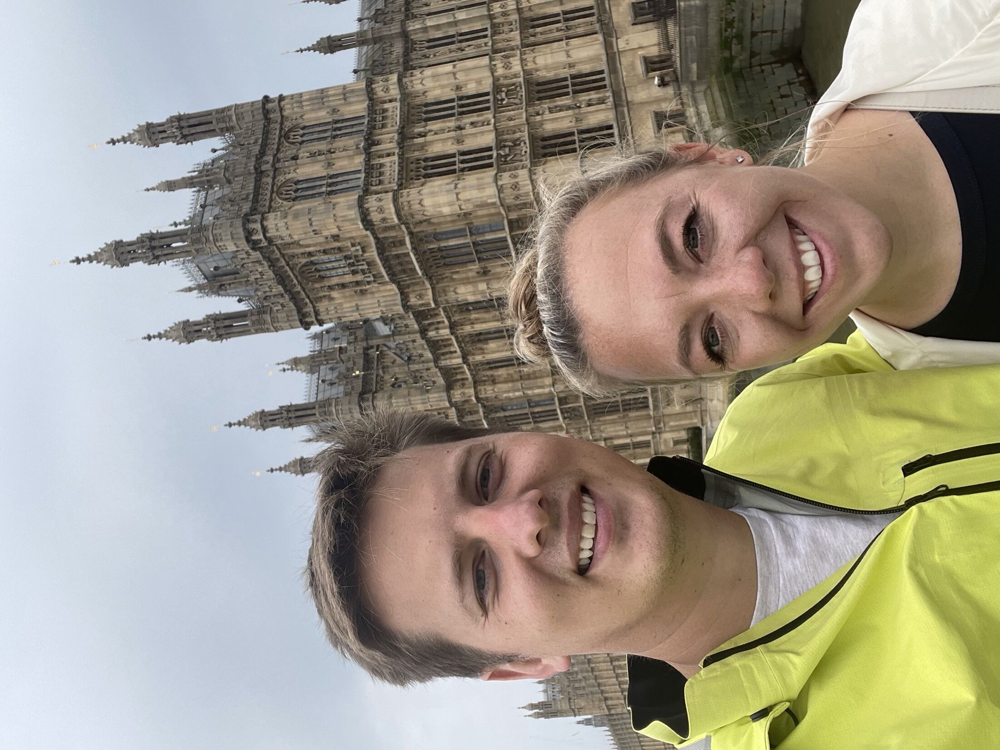

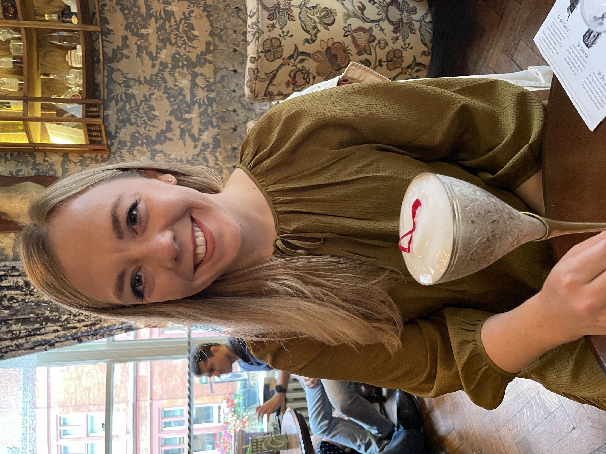

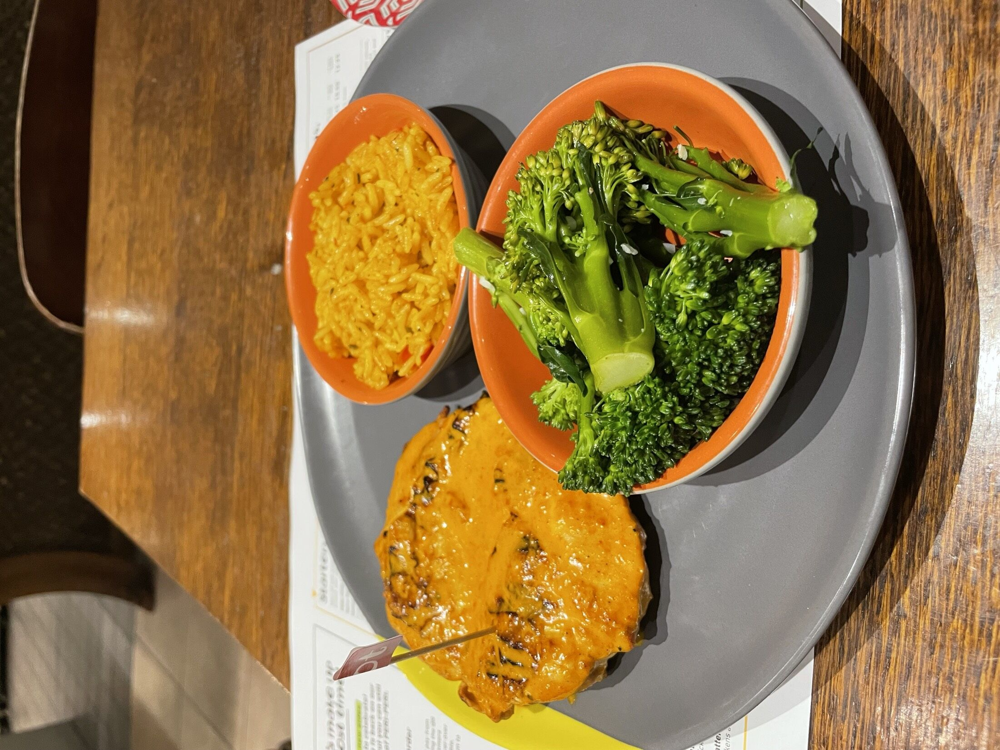

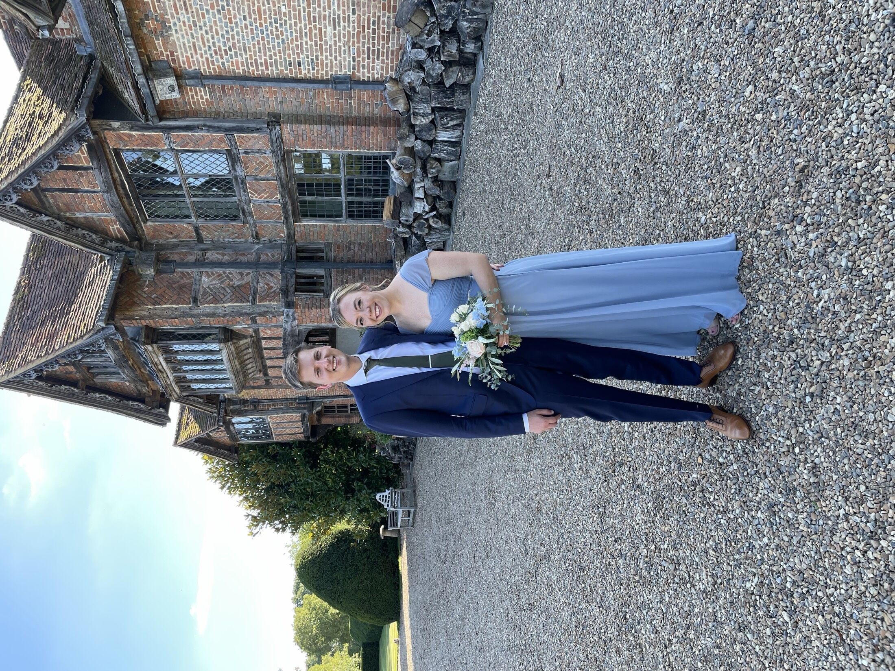

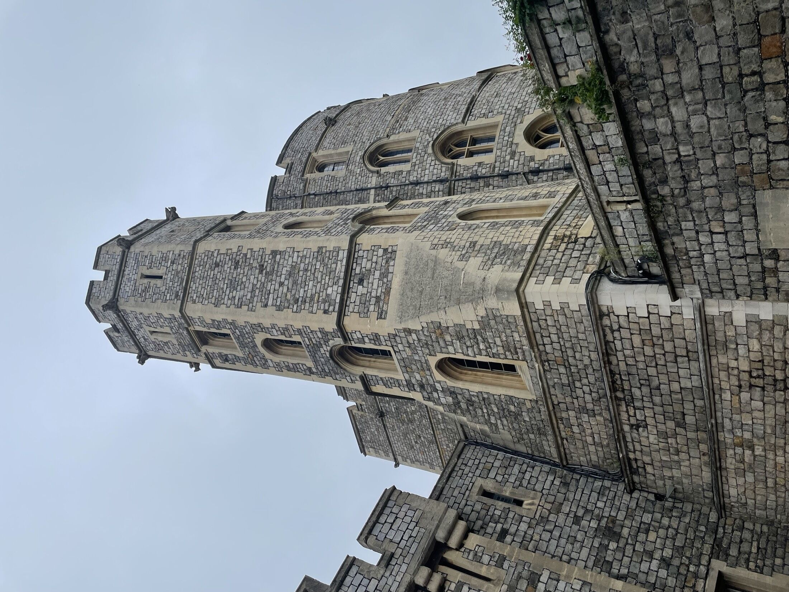

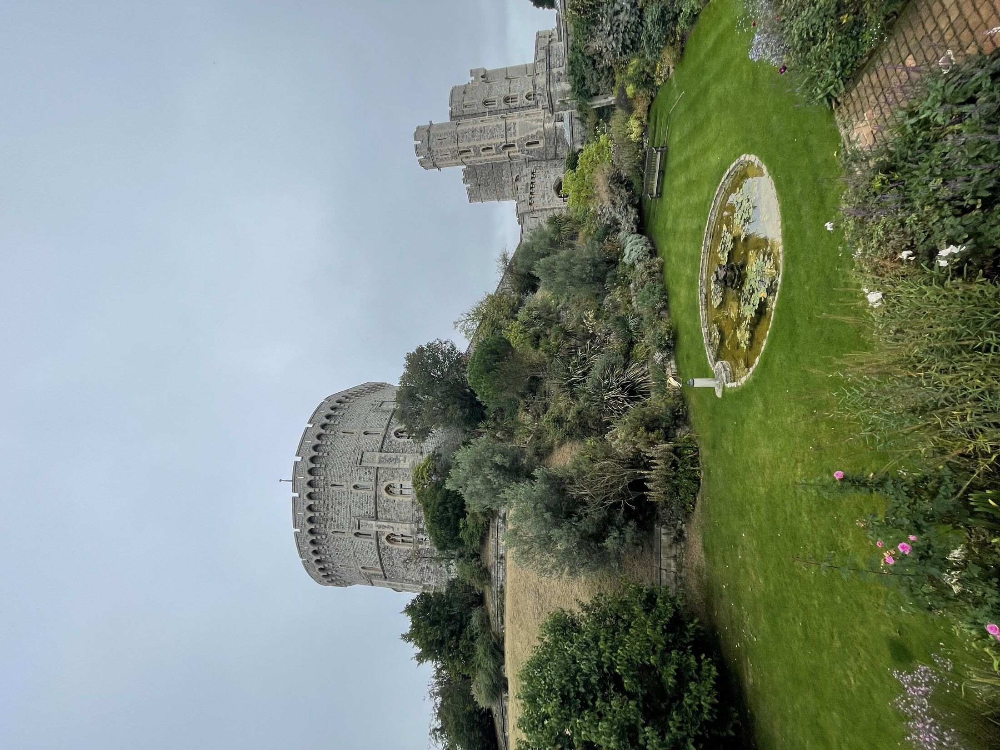

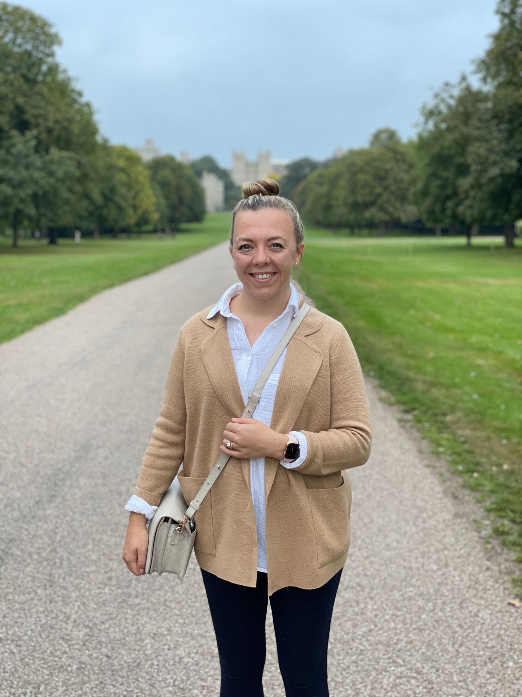
