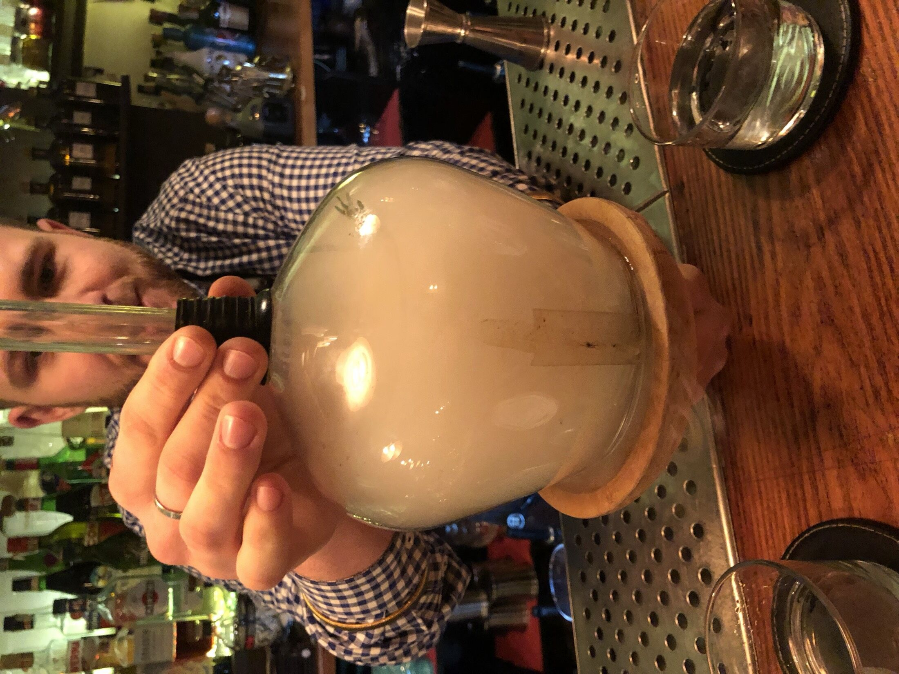
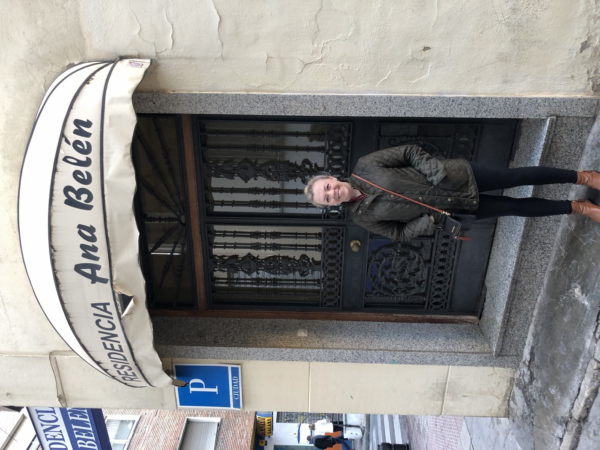
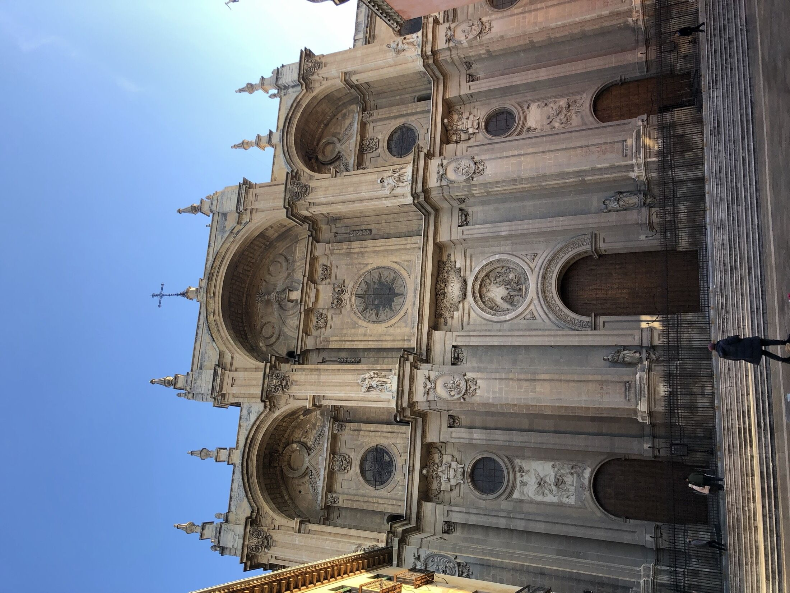
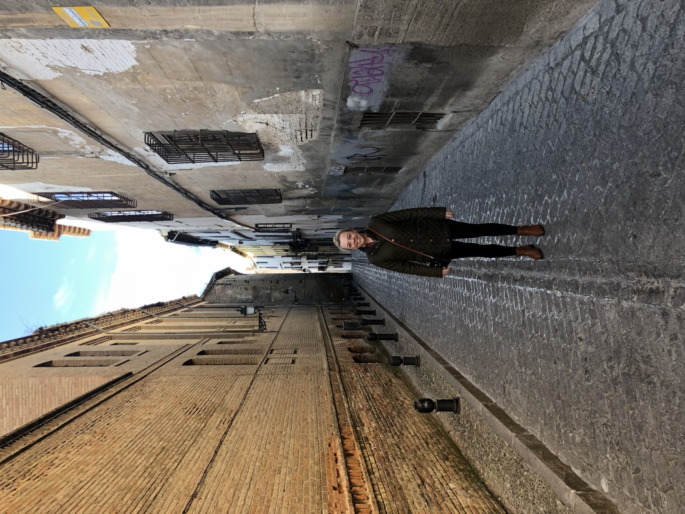
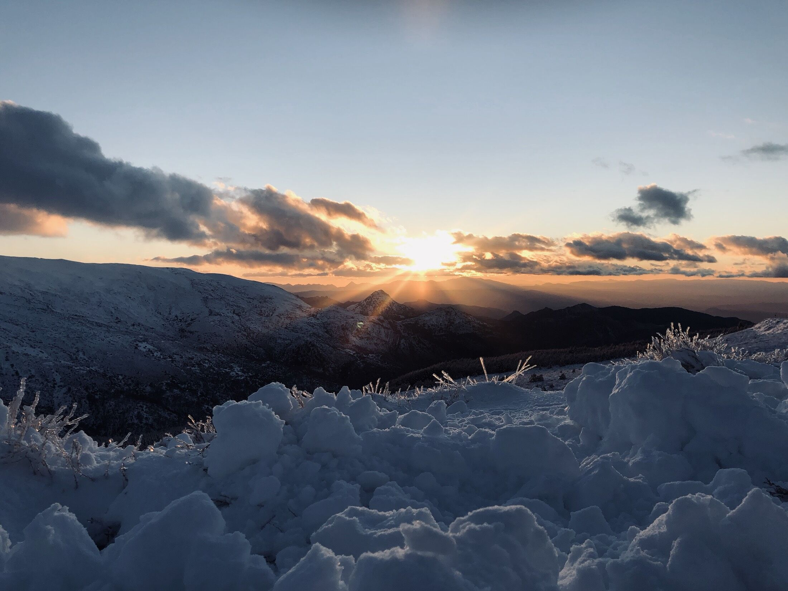
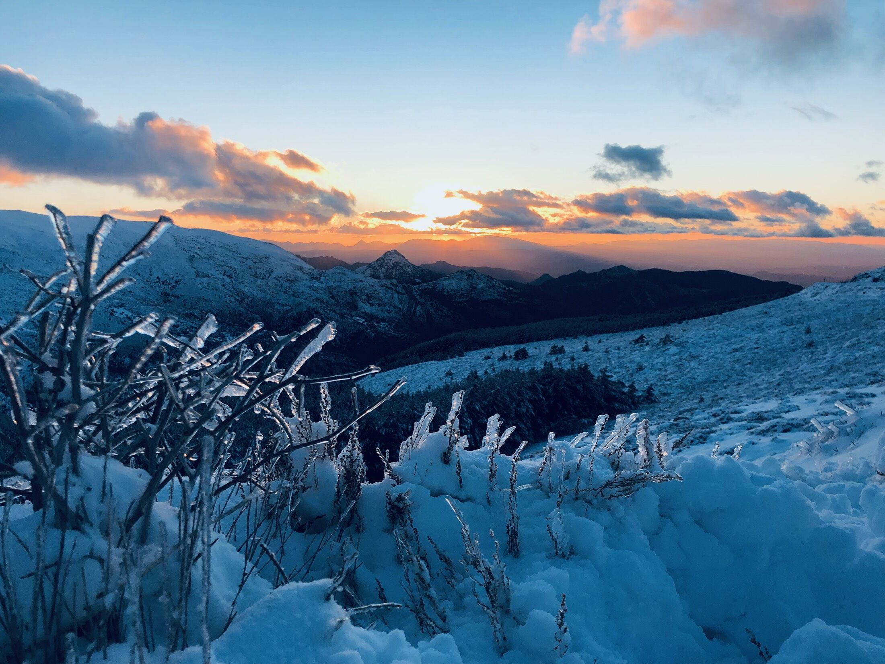

<!--
  Auto-scaffolded from 413 photos taken
  2019-01-13 – 2019-01-23 (11 days).
  Cities: Monachil, Granada, Barcelona, Luchthaven Schiphol.
  Write the story below; add alt text inside the  brackets for captions.
-->

TODO: Write about Monachil.

