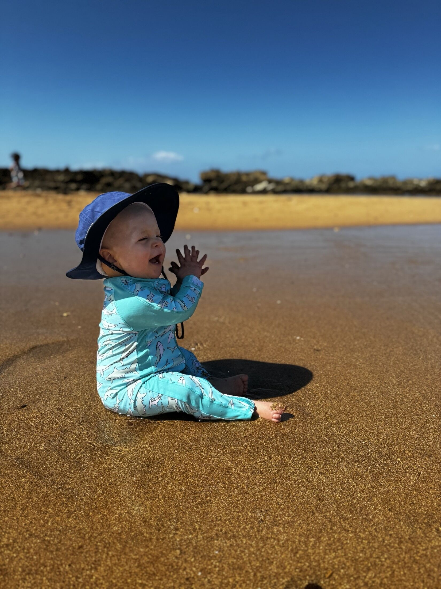
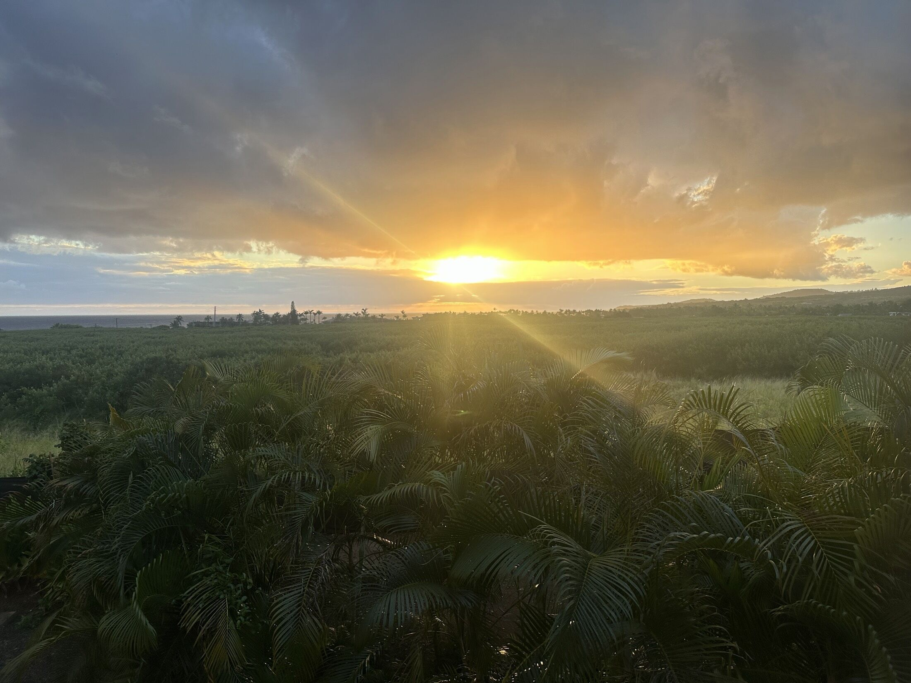
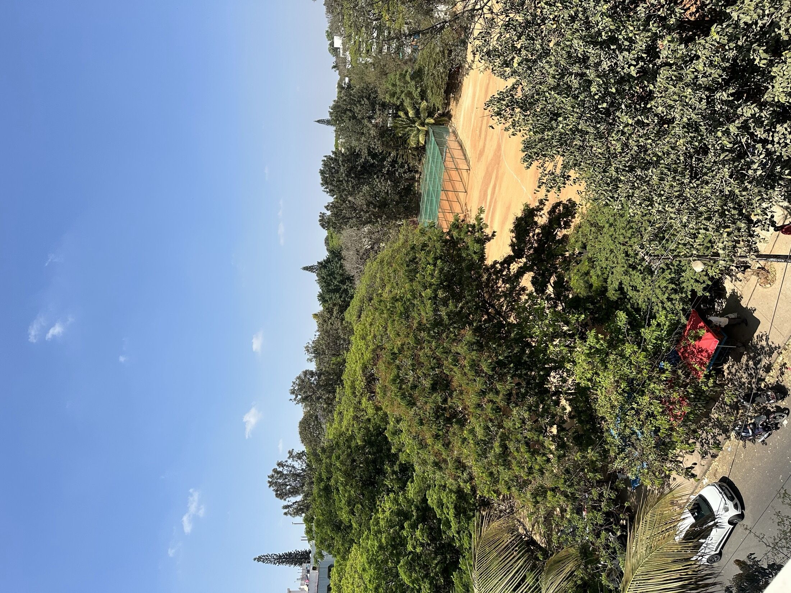

<!--
  Auto-scaffolded from 316 photos taken
  2024-02-15 – 2024-03-02 (17 days).
  Cities: Poʻipū, Bengaluru Urban, Bengaluru, Kalaheo, Singapore, Nāpali.
  Write the story below; add alt text inside the  brackets for captions.
-->

TODO: Write about Poʻipū.

