<!--
  Auto-scaffolded from 296 photos taken
  2019-06-10 – 2019-06-14 (5 days).
  Cities: Tel Aviv-Yafo, Old City Jerusalem, Jerusalem, Mevasseret Ziyyon.
  Write the story below; add alt text inside the  brackets for captions.
-->

TODO: Write about Tel Aviv-Yafo.

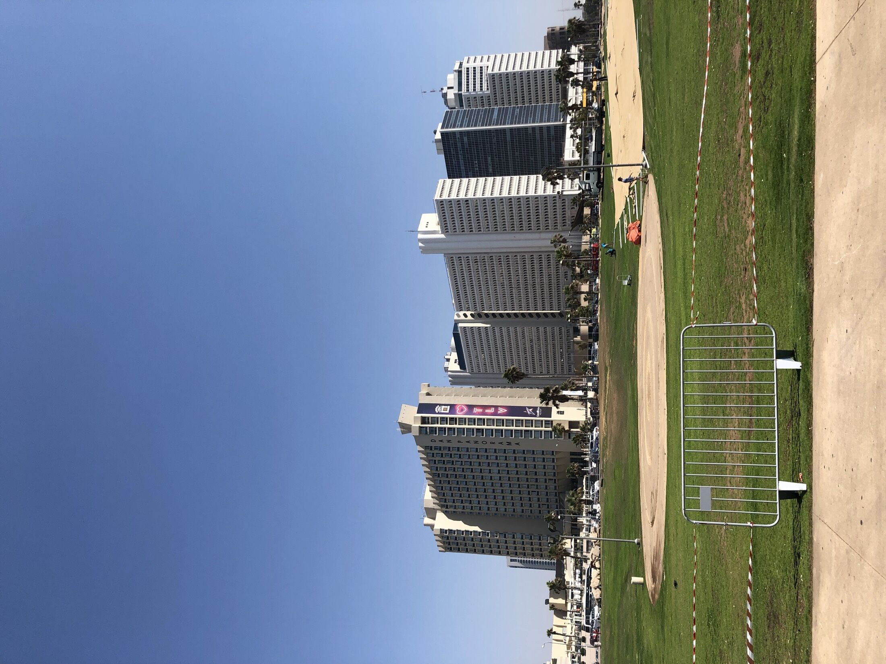

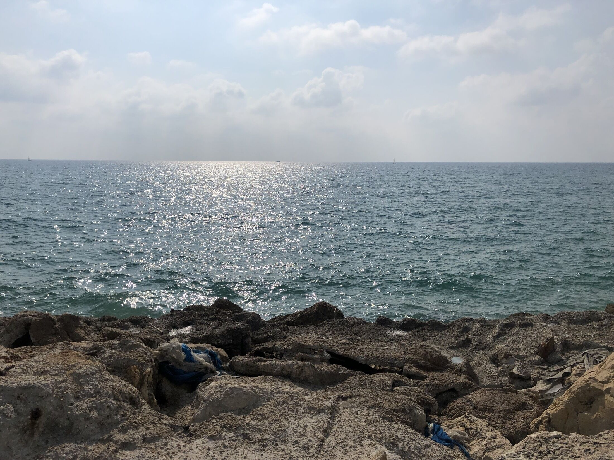

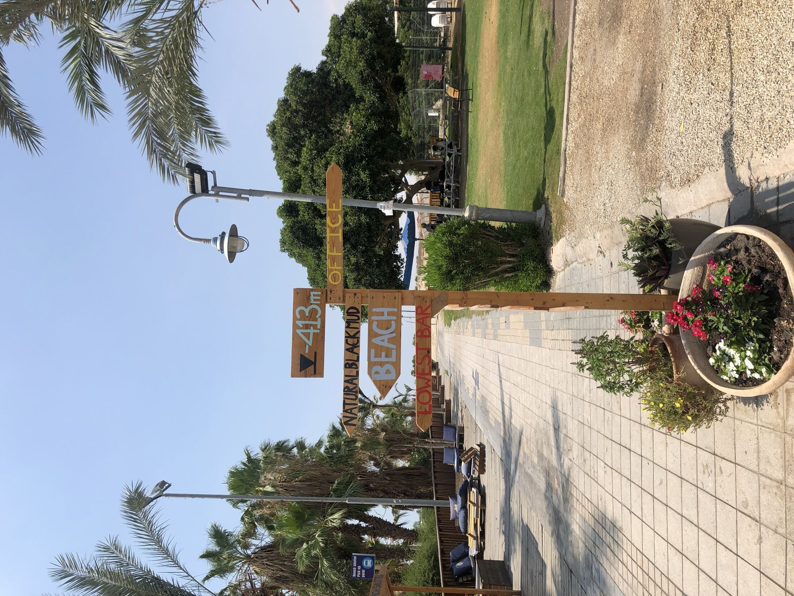

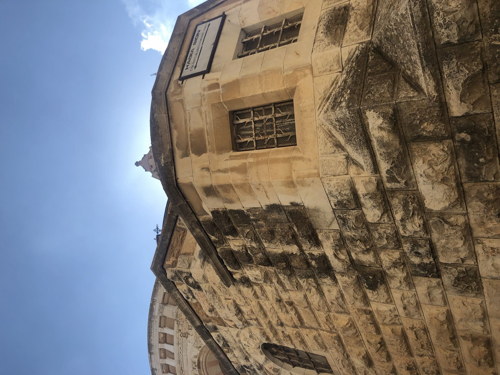

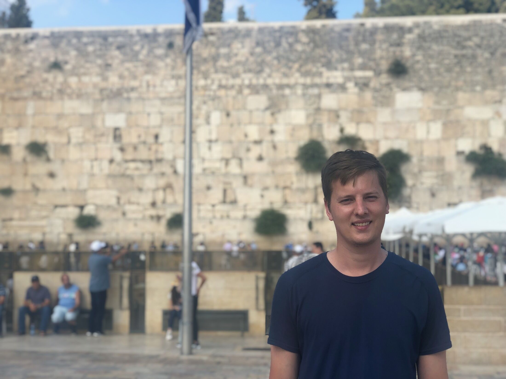

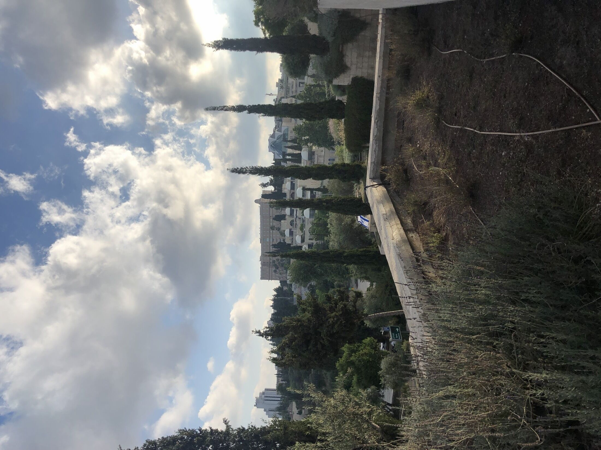

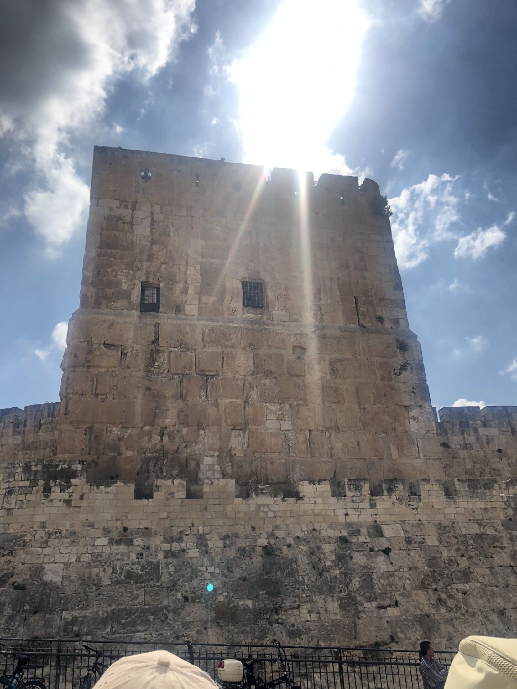

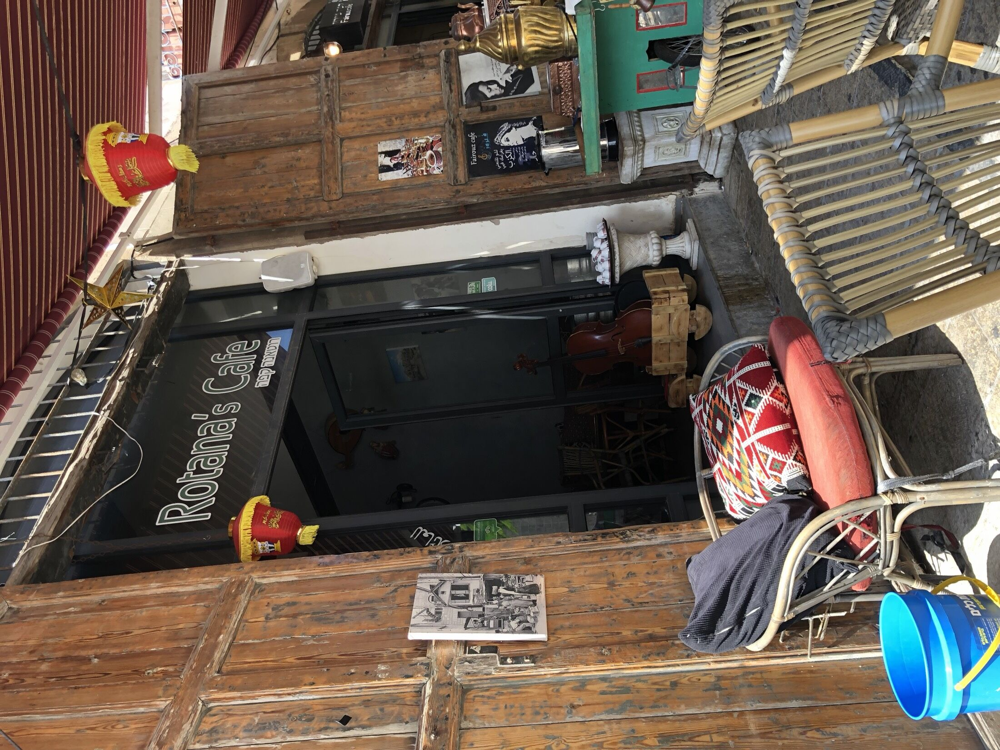

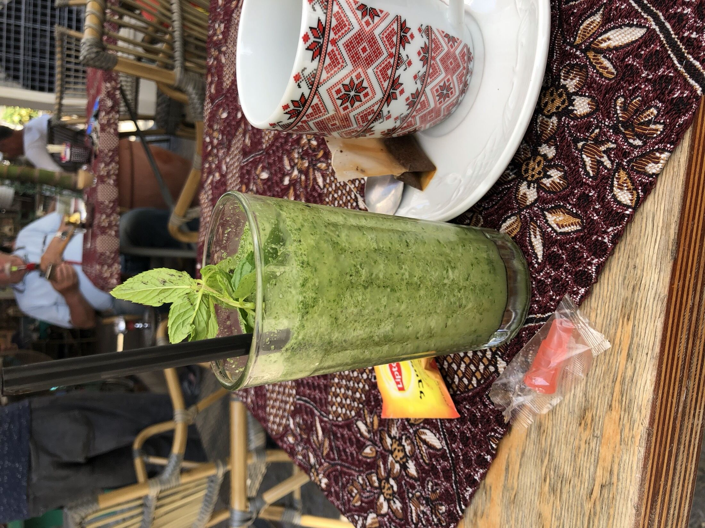

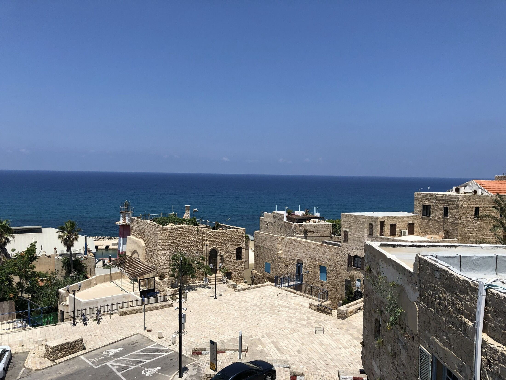

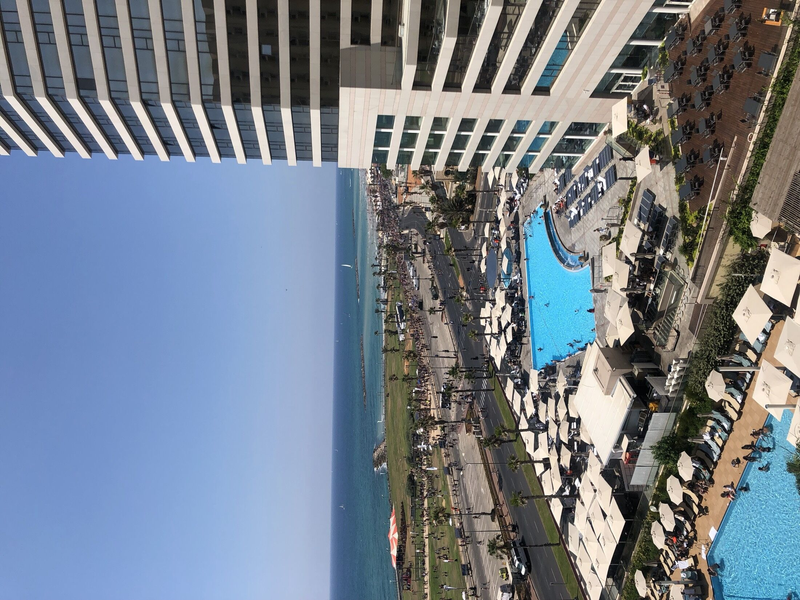

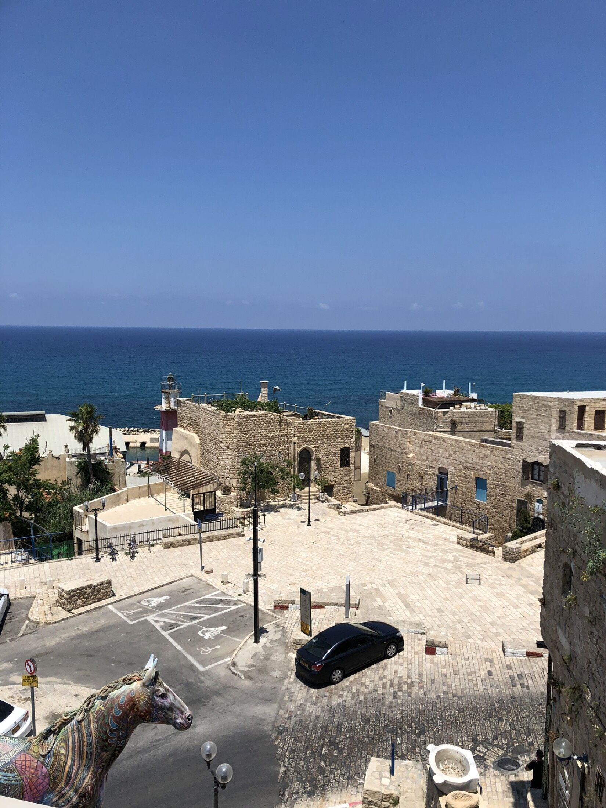
