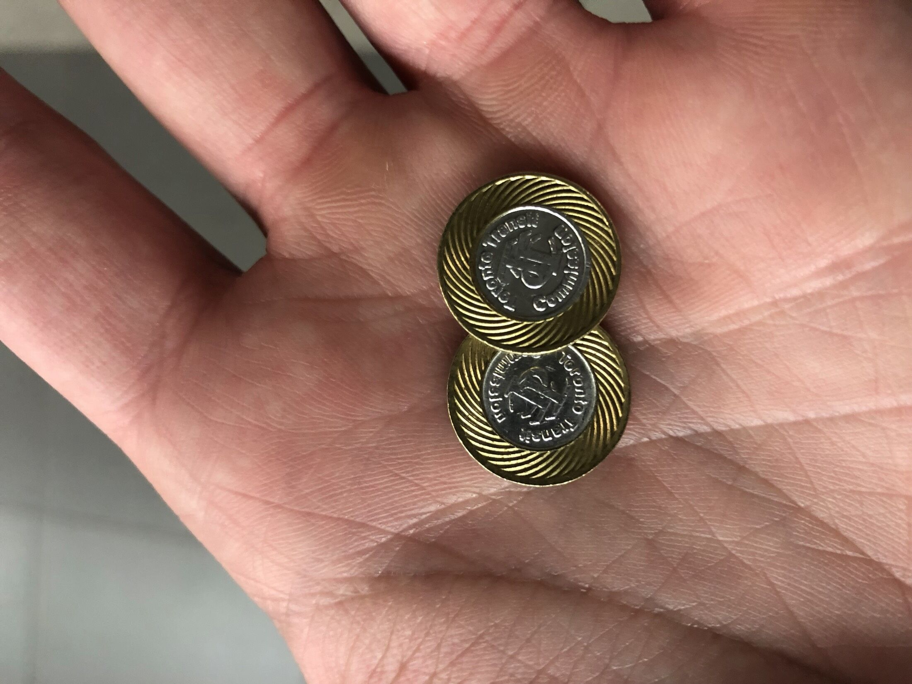
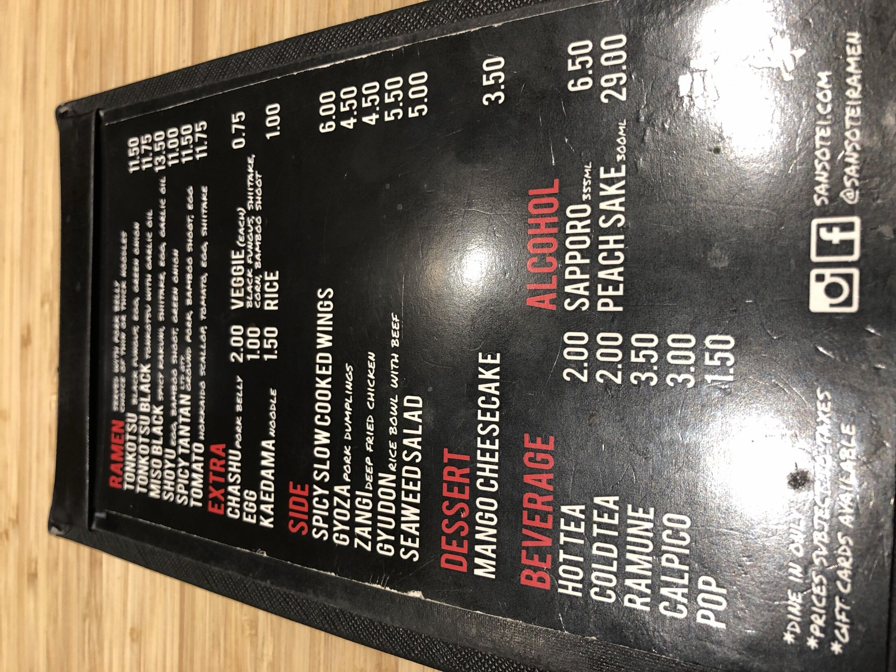
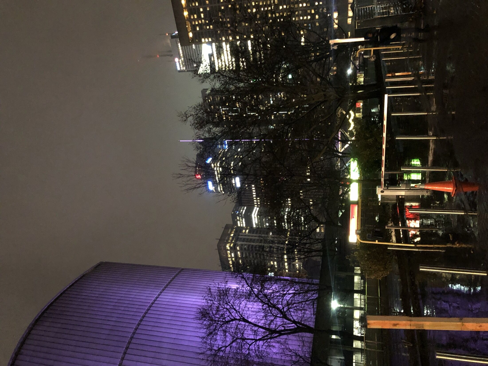
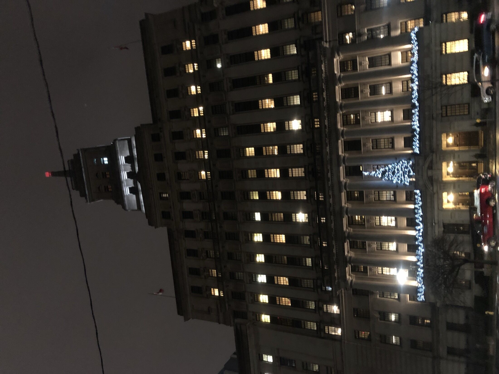
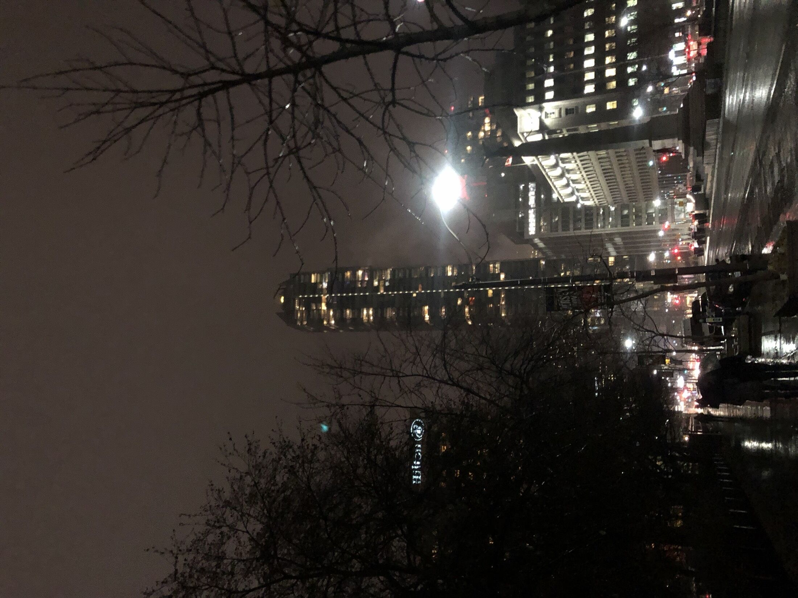
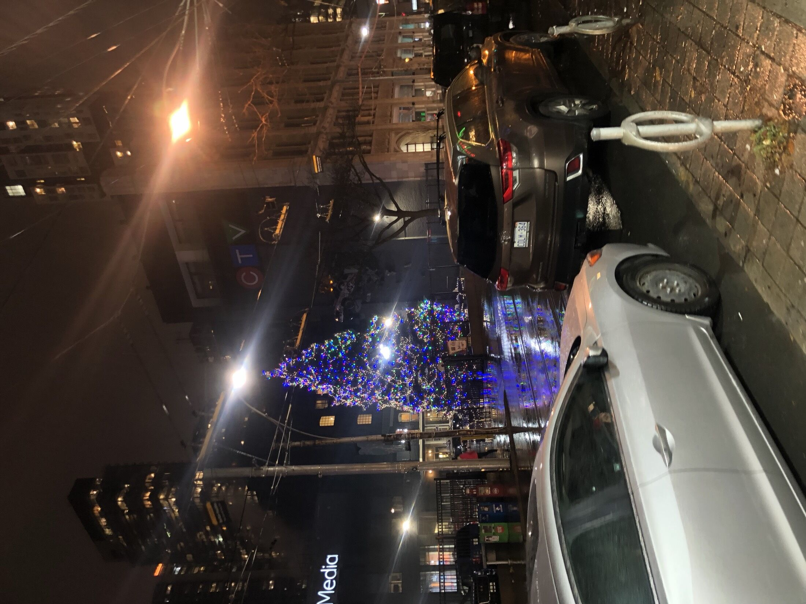
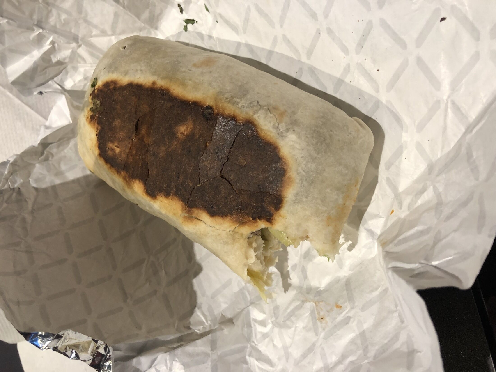
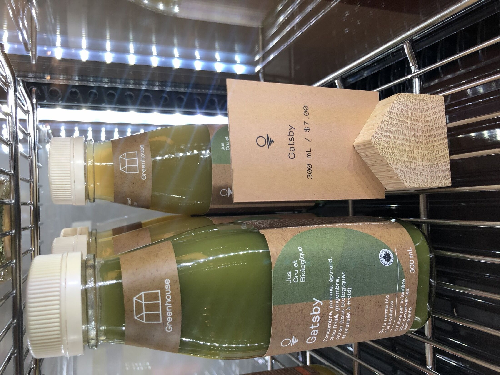
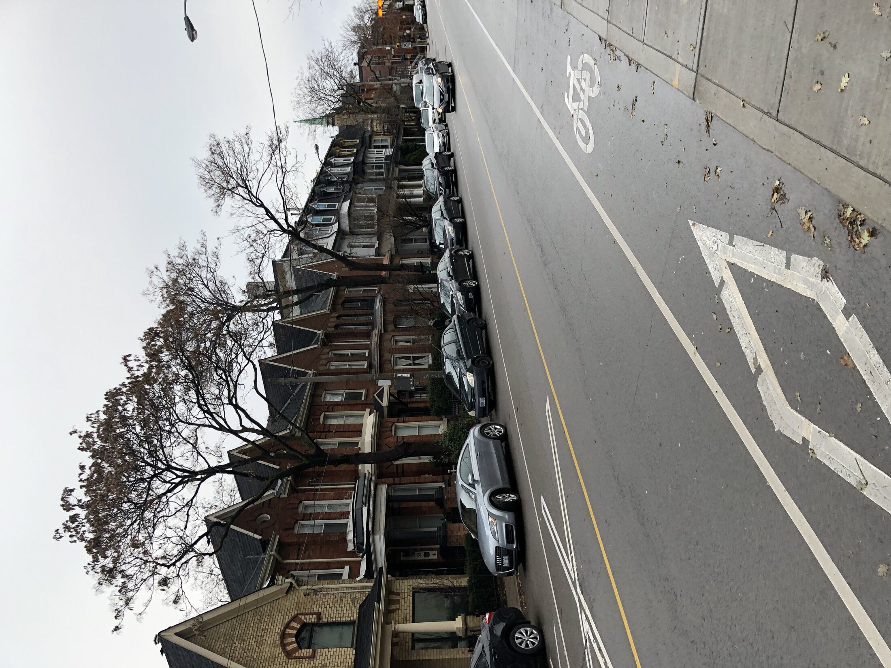
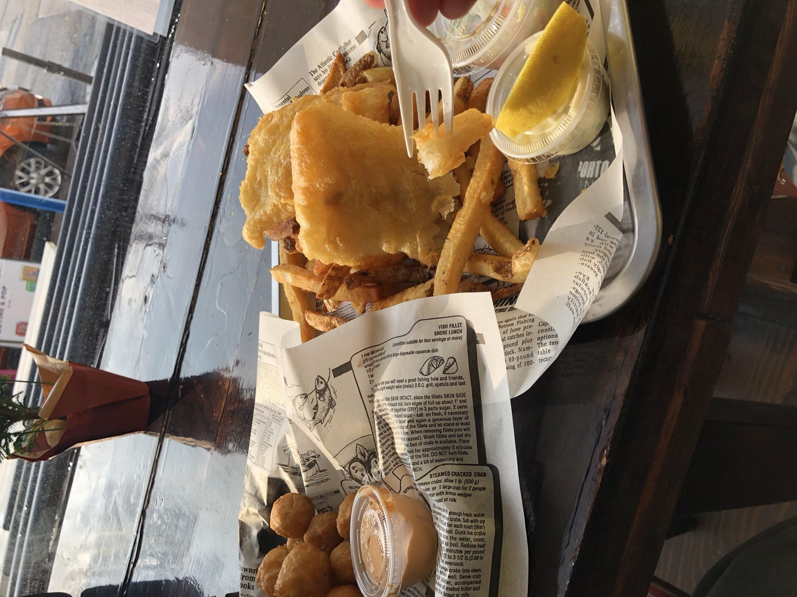

<!--
  Auto-scaffolded from 14 photos taken
  2018-11-30 – 2018-12-02 (3 days).
  Cities: Toronto.
  Write the story below; add alt text inside the  brackets for captions.
-->

TODO: Write about Toronto.

